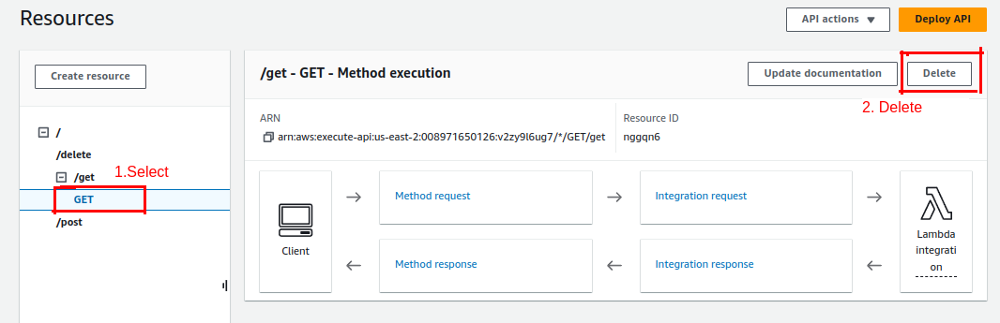
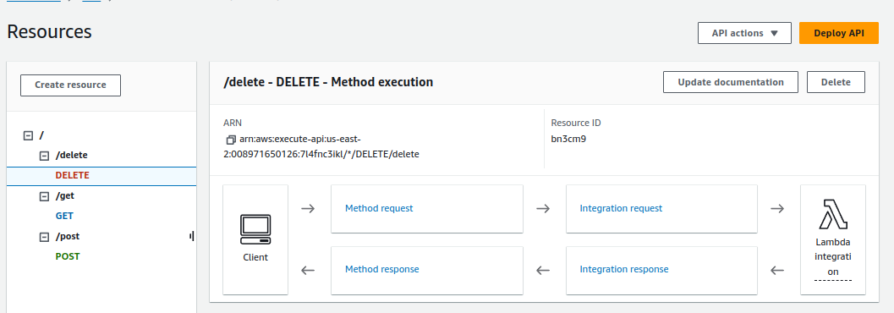
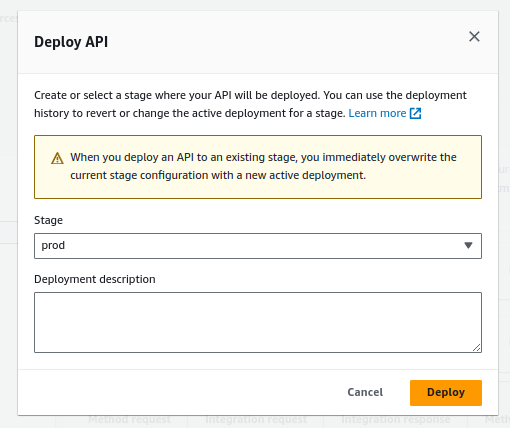
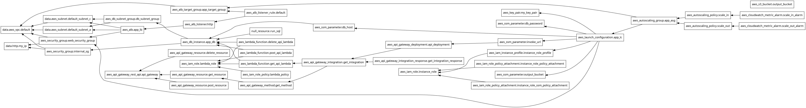

# Capstone Project - 
1. Prepare aws cli:
    ```bash
        #install aws cli 
        sudo apt install python3-pip -y
        pip3 install awscli --upgrade --user

        #To configure first create credentials for test_user(create test_user also) from IAM.
        #Then use Access key and Secret access key for configration aws cli.
        #configure aws cli.
        aws configure

        #test configuration
        aws ls 
    ```

1. Prepare env for functions
    ```bash
    python3 -m venv myenv
    source myenv/bin/activate


    pip install mysql-connector-python -t ./package

    cd functions/package
    zip -r9 ../lambda_function.zip .

    # cd ../.. && aws s3 cp functions/lambda_function.zip s3://output-bucket-streamlit-fs57ef/

    # s3://output-bucket-streamlit-fs57ef/lambda_function.zip
    ```
2. Start terraform and deploy Infrastructure.

    key creation exaple for EC2:

    ```bash
    ssh-keygen -t rsa -b 4096 -f ~/.ssh/my-aws-key
    ```
    - Press Enter when prompted for a passphrase, or enter one if you want to secure your private key with a passphrase.

    - Ensure the files are created in the specified directory:
        ```bash
        ls ~/.ssh/my-aws-key*
        ```


    ```bash
    cd ../.. # cd Capstone-Project
    terraform init
    terraform plan
    terraform graph | dot -Tpng > graph.png
    terraform apply
    ```

3. Create 3 Methods from console for routes: GET, POST, DELETE like pdf file, after delete existing method and integration for GET:

    Delete get method created by terraform.

    

    Create 3 methods for  GET, POST, DELETE like in pdf:

    [API Gateway - Create method.pdf](API%20Gateway%20-%20Create%20method.pdf)

    After created methods, it looks like below image.

    

    And deploy api to prod stage, like in below.

    


4. (Optional - If there is error.)

    Access EC2 and Connect to add database and table to rds if there is error.:
    ```bash

    # Fetch parameters from AWS Systems Manager Parameter Store
    export DATABASE_HOST=$(aws ssm get-parameter --name "/myapp/db_host" --query "Parameter.Value" --region "us-east-2" --output text)
    export DATABASE_PASSWORD=$(aws ssm get-parameter --name "/myapp/db_password" --with-decryption --query "Parameter.Value" --region "us-east-2" --output text)
    export DATABASE_USER=admin
    export OUTPUT_BUCKET_NAME=$(aws ssm get-parameter --name "/myapp/output_bucket" --query "Parameter.Value" --region "us-east-2" --output text)
    export API_BASE_URL=$(aws ssm get-parameter --name "/myapp/invoke_url" --query "Parameter.Value" --region "us-east-2" --output text)

    # Create example database and table, and insert sample data
    mysql -h $(aws ssm get-parameter --name "/myapp/db_host" --query "Parameter.Value" --region "us-east-2" --output text) -u admin -p$(aws ssm get-parameter --name "/myapp/db_password" --with-decryption --query "Parameter.Value" --region "us-east-2" --output text) -e "
    CREATE DATABASE IF NOT EXISTS employees;
    USE employees;

    CREATE TABLE IF NOT EXISTS employees (
        id INT AUTO_INCREMENT PRIMARY KEY,
        name VARCHAR(100),
        age INT,
        email VARCHAR(100)
    );

    INSERT INTO employees (name, age, email) VALUES 
    ('Alice Johnson', 30, 'alice.johnson@example.com'),
    ('Bob Smith', 25, 'bob.smith@example.com'),
    ('Carol Brown', 40, 'carol.brown@example.com');
    "

    ```

5. (Optional - If there is error.)
    Access EC2 and Connect to check app logs.
    ```bash
    #ssh for vm, log init script
    sudo tail -f /var/log/cloud-init-output.log # follow log
    sudo cat /var/log/cloud-init-output.log # all log
    ```

5. Test jsons:
    ```json
    //delete json
    {
    "body": "{\"id\":1}"
    }

    //post json
    {
        "body": "{\"name\": \"John Doe\", \"age\": 30, \"email\": \"john.doe@example.com\"}"
    }

    ```

5. Visit app.
    Visit app from terraform output app_url. It looks like:
    ```bash
    Outputs:

    api_url = "https://7l4fnc3ikl.execute-api.us-east-2.amazonaws.com/prod"
    app_url = "http://3.138.181.253:8501"
    host_db = "terraform-20240815112553658500000005.chkueg6coej3.us-east-2.rds.amazonaws.com"
    ```

5. Example curl commands

    ```bash

    curl -X GET <api_url>/get

    curl -X POST <api_url>/post \
    -H "Content-Type: application/json" \
    -d '{"body": "{\"name\": \"John Doe\", \"age\": 30, \"email\": \"john.doe@example.com\"}"}'


    curl -X DELETE <api_url>/delete \
    -H "Content-Type: application/json" \
    -d '{"body": "{\"id\": 1 }"}'


    ```

6. Destroy deployments.
    ```bash
    cd Capstone-Project
    terraform destroy
    ```


7. Infrastructure Graph:
    
