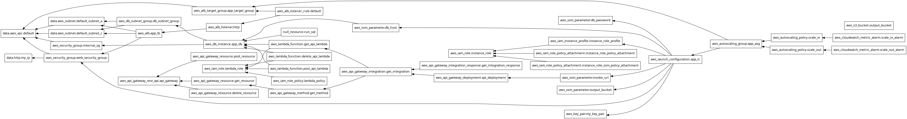

# Capstone Project - Three Tiers Web-App

1. ## AWS Infrastructure for Streamlit Application with RDS, API Gateway, and Lambda

    ### Overview

    This Terraform configuration sets up a comprehensive AWS infrastructure for deploying a web application using Streamlit, along with a MySQL RDS instance, an API Gateway, and Lambda functions for managing database interactions. The setup includes essential AWS components such as security groups, IAM roles, and an Application Load Balancer.

    ### Components

    1. **AWS Provider and Region Configuration**
        - Configures the AWS provider with a specified region.

    2. **VPC and Subnets**
        - References the default VPC and identifies default subnets in specified availability zones.

    3. **Key Pair**
        - Creates an SSH key pair for secure access to EC2 instances.

    4. **Security Groups**
        - Defines security groups to allow traffic for HTTP, HTTPS, MySQL, and Streamlit applications.
        - Allows SSH access from the user’s IP and AWS EC2 Instance Connect IP ranges.

    5. **RDS Instance**
        - Creates a MySQL RDS instance in the default subnets.
        - Configures database backups conditionally and initializes the database schema with sample data.

    6. **IAM Roles and Policies**
        - Sets up IAM roles and policies for EC2 instances and Lambda functions.
        - Grants necessary permissions for S3 access, SSM Parameter Store, and Lambda operations.

    7. **Lambda Functions**
        - Deploys three Lambda functions (`get_api_lambda`, `post_api_lambda`, `delete_api_lambda`) to handle CRUD operations with the database.
        - Configures environment variables to provide database connectivity details.

    8. **API Gateway**
        - Creates an API Gateway with resources and methods to expose Lambda functions as HTTP endpoints.

    9. **S3 Bucket**
        - Configures an S3 bucket for storing application output with versioning enabled.

    10. **Application Load Balancer (ALB)**
        - Sets up an Application Load Balancer for distributing traffic to the Streamlit application.
        - Defines a target group for the Streamlit app and configures listener rules.

    11. **Launch Configuration**
        - Defines an EC2 launch configuration with a specified AMI, instance type, and security groups.
        - Configures user data to install dependencies, deploy the Streamlit application, and configure Nginx.

    ### Deployment Steps

    1. **Initialize Terraform**
        ```bash
        terraform init
        ```

    2. **Apply Configuration**
        ```bash
        terraform apply
        ```

    3. **Access the Application**
        - The Streamlit application will be accessible via the Application Load Balancer's DNS name.

    4. **API Integration**
        - Lambda functions can be invoked via the API Gateway endpoints created.


    ### Notes:

    - Ensure that the ami-003932de22c285676 used in the launch configuration is appropriate for your region and use case.
    - Update the aws_key_pair configuration to use your own SSH public key.
    - Review and update security group rules and IAM policies as needed to comply with your security requirements.
    - For a more secure setup, AWS Lambda functions can be configured to run within a Virtual Private Cloud (VPC) and use internal security groups (SGs). This approach enhances security by isolating Lambda functions and controlling network access. However, manually setting up these configurations can be time-consuming with Terraform. Not sure is whether it is bug or not.

        ```bash

            # internal_sg cidr block
            cidr_blocks = [data.aws_vpc.default.cidr_block, "${chomp(data.http.my_ip.body)}/32"]  

        ``` 

        ```python

            #lambda functions vpc config
            vpc_config {
                subnet_ids = [data.aws_subnet.default_subnet_a.id , data.aws_subnet.default_subnet_a.id]
                security_group_ids = [ aws_security_group.internal_sg.id ]
            }

        ```

    This setup provides a scalable and manageable infrastructure for deploying a Streamlit-based application integrated with AWS services.


1. ## Detailed Instructions:
    1. Prepare aws cli:
        ```bash
            #install aws cli 
            sudo apt install python3-pip -y
            pip3 install awscli --upgrade --user

            #To configure first create credentials for test_user(create test_user also) from IAM.
            #Then use Access key and Secret access key for configration aws cli.
            #configure aws cli.
            aws configure

            #test configuration
            aws ls 
        ```

    1. Prepare env for functions
        ```bash
        python3 -m venv myenv
        source myenv/bin/activate

        mdkir package
        pip install mysql-connector-python -t ./package

        cp *.py ./package

        cd functions/package
        zip -r9 ../lambda_function.zip .

        # cd ../.. && aws s3 cp functions/lambda_function.zip s3://<your-bucket>/

        # aws s3 ls s3://<your-bucket>/lambda_function.zip
        ```
    2. Start terraform and deploy Infrastructure.

        key creation exaple for EC2:

        ```bash
        ssh-keygen -t rsa -b 4096 -f ~/.ssh/my-aws-key
        ```
        - Press Enter when prompted for a passphrase, or enter one if you want to secure your private key with a passphrase.

        - Ensure the files are created in the specified directory:
            ```bash
            ls ~/.ssh/my-aws-key*
            ```


        ```bash
        cd ../.. # cd Capstone-Project
        terraform init
        terraform plan
        terraform graph | dot -Tpng > graph.png
        terraform apply
        ```

    3. Create 3 Methods from console for routes: GET, POST, DELETE like pdf file, after delete existing method and integration for GET:

        Delete get method created by terraform.

        

        Create 3 methods for  GET, POST, DELETE like in pdf:

        [API Gateway - Create method.pdf](API%20Gateway%20-%20Create%20method.pdf)

        After created methods, it looks like below image.

        

        And deploy api to prod stage, like in below.

        


    4. (Optional - If there is error.)

        Access EC2 and Connect to add database and table to rds if there is error.:
        ```bash

        # Fetch parameters from AWS Systems Manager Parameter Store
        export DATABASE_HOST=$(aws ssm get-parameter --name "/myapp/db_host" --query "Parameter.Value" --region "us-east-2" --output text)
        export DATABASE_PASSWORD=$(aws ssm get-parameter --name "/myapp/db_password" --with-decryption --query "Parameter.Value" --region "us-east-2" --output text)
        export DATABASE_USER=admin
        export OUTPUT_BUCKET_NAME=$(aws ssm get-parameter --name "/myapp/output_bucket" --query "Parameter.Value" --region "us-east-2" --output text)
        export API_BASE_URL=$(aws ssm get-parameter --name "/myapp/invoke_url" --query "Parameter.Value" --region "us-east-2" --output text)

        # Create example database and table, and insert sample data
        mysql -h $(aws ssm get-parameter --name "/myapp/db_host" --query "Parameter.Value" --region "us-east-2" --output text) -u admin -p$(aws ssm get-parameter --name "/myapp/db_password" --with-decryption --query "Parameter.Value" --region "us-east-2" --output text) -e "
        CREATE DATABASE IF NOT EXISTS employees;
        USE employees;

        CREATE TABLE IF NOT EXISTS employees (
            id INT AUTO_INCREMENT PRIMARY KEY,
            name VARCHAR(100),
            age INT,
            email VARCHAR(100)
        );

        INSERT INTO employees (name, age, email) VALUES 
        ('Alice Johnson', 30, 'alice.johnson@example.com'),
        ('Bob Smith', 25, 'bob.smith@example.com'),
        ('Carol Brown', 40, 'carol.brown@example.com');
        "

        ```

    5. (Optional - If there is error.)
        Access EC2 and Connect to check app logs.
        ```bash
        #ssh for vm, log init script
        sudo tail -f /var/log/cloud-init-output.log # follow log
        sudo cat /var/log/cloud-init-output.log # all log
        ```

    5. Lambda Test jsons:
        ```json
        //delete json
        {
        "body": "{\"id\":1}"
        }

        //post json
        {
            "body": "{\"name\": \"John Doe\", \"age\": 30, \"email\": \"john.doe@example.com\"}"
        }

        ```

    5. Visit app.
        Visit app from terraform output alb_url. It looks like:
        ```bash
        Outputs:

        alb_url = "http://app-load-balancer-824820823.us-east-2.elb.amazonaws.com"
        api_url = "https://7l4fnc3ikl.execute-api.us-east-2.amazonaws.com/prod"
        host_db = "terraform-20240815112553658500000005.chkueg6coej3.us-east-2.rds.amazonaws.com"
        ```

    6. Test with script.sh:

        You can test application load balancer with test.sh script:

        ```bash
        chmod +x test/test.sh
        ./test/test.sh
        # check requested ip addresses, application load balancer distribute traffics to two ec2s. 
        ```


    5. Example curl commands

        ```bash

        curl -X GET <api_url>/get

        curl -X POST <api_url>/post \
        -H "Content-Type: application/json" \
        -d '{"body": "{\"name\": \"John Doe\", \"age\": 30, \"email\": \"john.doe@example.com\"}"}'


        curl -X DELETE <api_url>/delete \
        -H "Content-Type: application/json" \
        -d '{"body": "{\"id\": 1 }"}'


        ```

    6. Destroy deployments.
        ```bash
        cd Capstone-Project
        terraform destroy
        ```


    7. Infrastructure Graph:
        
