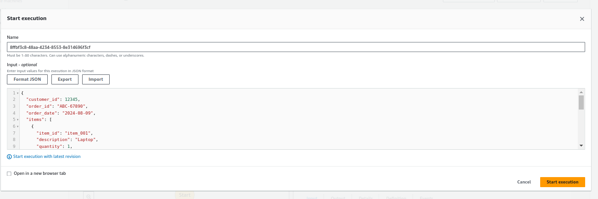
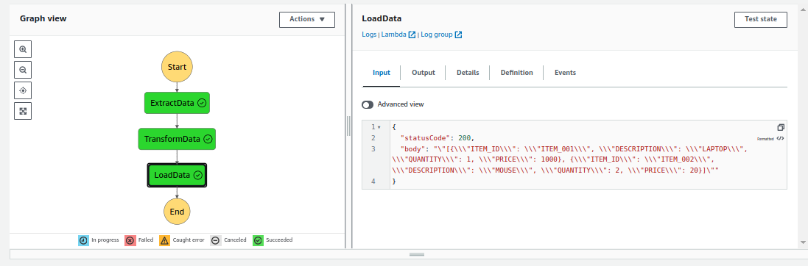

Configure AWS cli:
```bash
#install aws cli 
sudo apt install python3-pip -y
pip3 install awscli --upgrade --user

#To configure first create credentials for test_user(create test_user also) from IAM.
#Then use Access key and Secret access key for configration aws cli.
#configure aws cli.
aws configure

#test configuration
aws ls 
```
Deploy Infrastucture:
```bash
cd Day9-DBMigration-S3-EBS/implementations/ebs-cost-optimization

zip input_file.zip input_file.json
zip extract_data.zip extract_data.py
zip load_data.zip load_data.py
zip transform_data.zip transform_data.py


terraform init
terraform plan
terraform graph | dot -Tpng > graph.png
terraform apply
```

input:


output:


Control output bucket:
```bash

aws s3 ls s3://output-bucket-b54e6r84bt3h/

```

Destroy Infrastructure:
```bash
terraform destroy
```

