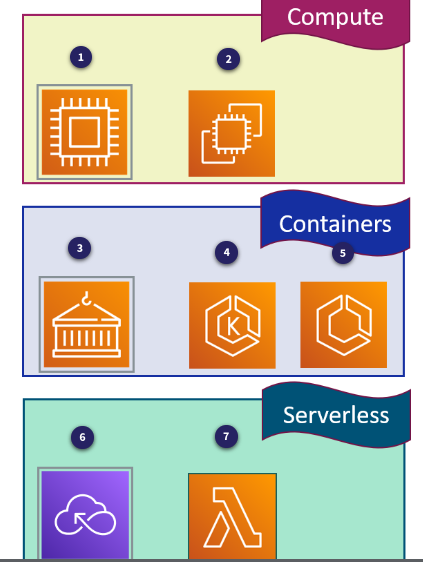
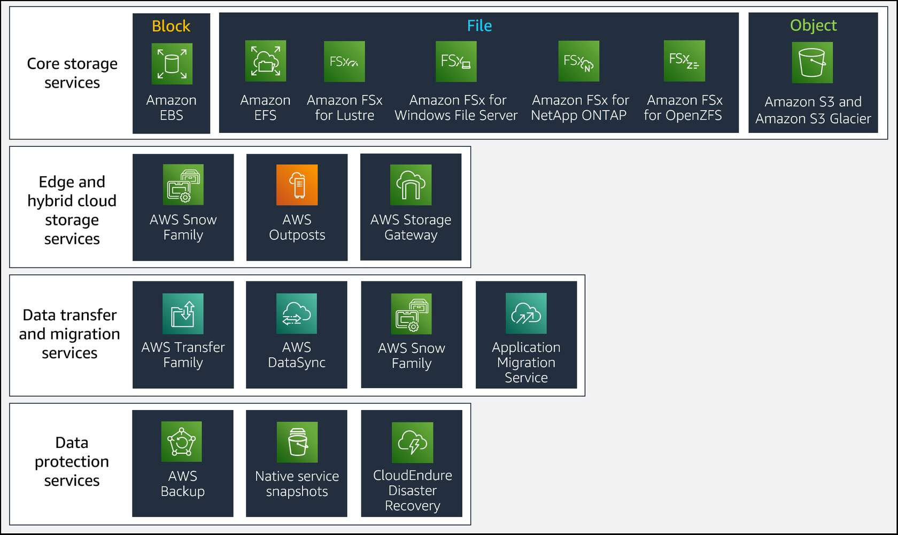
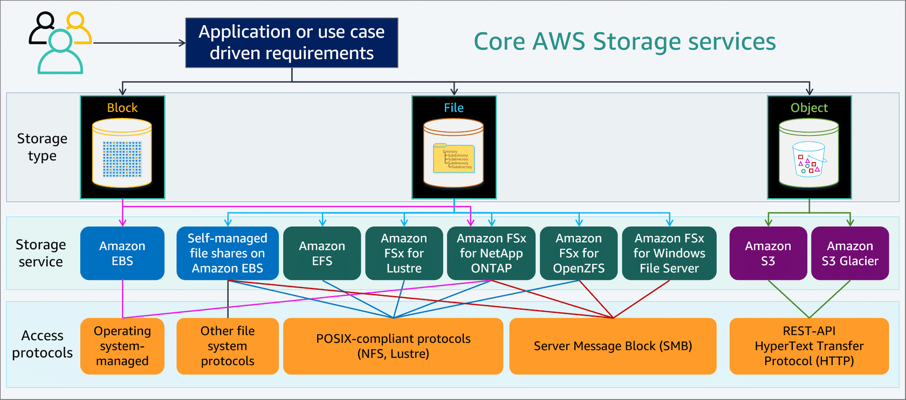
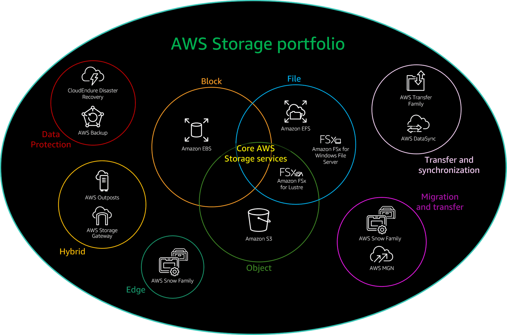
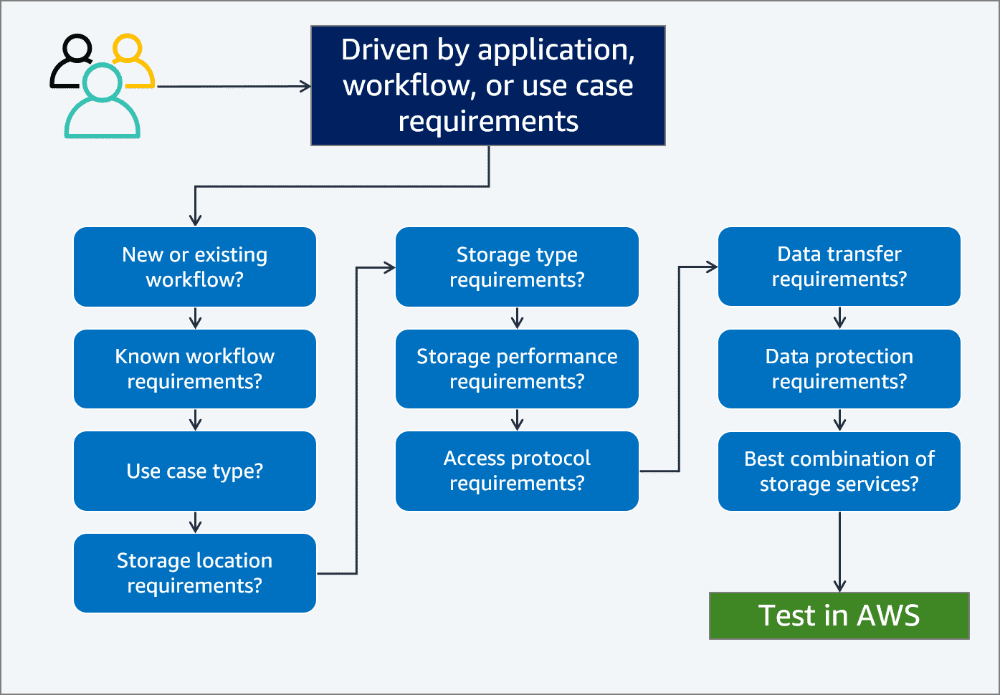

# 2. Day 2 - AWS Compute Services Overview

### 2.1. AWS Compute Options

#### 2.1.1. AWS Compute Options

- **Compute**: Refers to the resources like CPU, memory, and GPUs required to run applications. AWS offers different compute options to match various workloads.
- **Cloud Computing**: Provides access to vast resources over the internet, allowing for scalability (elasticity) and cost efficiency. You only pay for what you use and can scale up or down as needed.
- **AWS Compute Categories**: AWS offers three primary categories for compute: 
  - **Compute Instances** (e.g., EC2)
  - **Containers** (e.g., ECS, EKS, Fargate)
  - **Serverless** (e.g., Lambda, AWS Fargate, Step Functions)
- **Elasticity in AWS**: AWS allows you to automatically scale resources to meet demand, ensuring your application remains performant without unnecessary costs.

Services in the Image:

1. **Compute (Top Section)**:
   - **1**: Represents EC2 (Elastic Compute Cloud) - AWS's core compute service offering scalable virtual servers.
   - **2**: Represents AWS Auto Scaling - Automatically adjusts the number of EC2 instances based on demand.

2. **Containers (Middle Section)**:
   - **3**: Represents AWS ECS (Elastic Container Service) - A fully managed container orchestration service.
   - **4**: Represents Amazon EKS (Elastic Kubernetes Service) - A managed service to run Kubernetes on AWS.
   - **5**: Represents AWS Fargate - A serverless compute engine for containers that works with ECS and EKS.

3. **Serverless (Bottom Section)**:
   - **6**: Represents AWS Step Functions - A service that orchestrates serverless workflows by combining AWS services.
   - **7**: Represents AWS Lambda - A serverless compute service that automatically runs code in response to events.

#### 2.1.2. Defining Serverless Computing

- **Serverless Abstraction**: Serverless computing abstracts not just the physical infrastructure but also instances and operating systems, allowing developers to focus solely on writing and deploying code without worrying about managing servers.
- **AWS Serverless**: In AWS, serverless computing means your code runs on servers managed by AWS, freeing you from maintaining hardware or infrastructure. AWS automatically handles scaling, load balancing, and server maintenance.
- **Focus on Development**: By using serverless, development teams can concentrate on coding and innovation, improving their ability to quickly release, gather feedback, and refine applications, leading to faster development cycles.
- **Cost Efficiency**: With AWS Lambda, you only pay for the compute time you use, as opposed to paying for idle resources like with traditional instances, making it a cost-effective option for many applications.
- **Flexible Deployment**: Serverless functions like AWS Lambda can be triggered by various AWS services or directly from web and mobile applications, providing flexibility in deployment and integration.

#### 2.1.3 Selecting Right Compute

##### 2.2.3.1. Compute Types and Features

- **Amazon EC2**: Offers granular control with customizable virtual servers, providing over 500 instance types. It's ideal for long-running applications, and you can scale resources as needed with high availability and various pricing options.
  
- **Containers**: Efficient, fast, and portable, containers encapsulate applications with all dependencies, enabling consistent performance across environments. They support microservices architectures and run without startup latency or size limitations.
  
- **Serverless (AWS Lambda)**: Abstracts the infrastructure layer, allowing you to focus on code without managing servers. It’s cost-effective for short-lived, event-driven applications with automatic scaling and resilience features.
  
- **Compute Selection**: Choosing the right compute type (EC2, containers, or serverless) depends on your application’s needs for control, scalability, cost efficiency, and deployment speed.

##### 2.2.3.2. Choosing a Compute Option for your Workload

- **Assess Workload Needs**: Understand your application's performance characteristics and workload requirements to choose the optimal compute option.
- **Amazon EC2**: Ideal for applications requiring full control over the OS, complex networking, or specific instance types. Suited for compute-intensive, stateful, and long-running applications.
- **Containers (ECS/EKS)**: Best for applications needing fast scaling, containerization of monolithic apps, or those that benefit from microservices architecture. Suitable when migrating large applications without altering the code.
- **Serverless (AWS Lambda)**: Optimal for lightweight, stateless, short-duration tasks (under 15 minutes). Focus on code without managing infrastructure; ideal for small, modular apps and event-driven workflows.
- **Testing and Performance**: When unsure, test workloads on multiple compute types and let performance data guide the decision.
- **Container Challenges**: Avoid containers for applications needing complex networking or persistent storage, as these can increase complexity and reduce portability.

##### 2.2.3.3. Additional Compute Options

- **Amazon EC2**: The foundational building block for many AWS services, providing the underlying compute power for diverse applications and workloads.
- **AWS Lambda**: A serverless compute service where you run small, stateless functions in response to events. Lambda scales automatically based on the rate of incoming requests, making it ideal for event-driven applications.
- **AWS Step Functions**: A service for coordinating distributed applications and microservices using visual workflows. It allows you to automate complex workflows, handle retries, and track the execution state of each step.
- **AWS Batch**: A fully managed service for running batch computing jobs efficiently. AWS Batch dynamically provisions compute resources based on job requirements and supports running on EC2, Fargate, or Spot Instances.
- **AWS Elastic Beanstalk**: A platform-as-a-service (PaaS) that simplifies deploying and managing applications. Elastic Beanstalk automatically handles the details of capacity provisioning, load balancing, scaling, and monitoring.
- **Amazon Lightsail**: A Virtual Private Server (VPS) provider ideal for simple workloads. It offers an easy-to-use, low-cost option for deploying and managing websites and applications, with pre-configured cloud resources.

### 2.2. STORAGE - Introduction 

#### 2.2.1 On-Premises Storage versus AWS Cloud Storage

- **Agility and Flexibility**:
  - **On-Premises Storage**: Changes are slow and resource-intensive; often requires lengthy approval and installation processes. Limited flexibility in reallocating storage capacity.
  - **AWS Cloud Storage**: Provides on-demand scalability with minimal setup time. Easily add, reduce, or change storage services as needed.

- **Innovation and Development**:
  - **On-Premises Storage**: Limited by existing infrastructure; new systems or resources are needed for innovation, often involving significant lead times and capacity constraints.
  - **AWS Cloud Storage**: Facilitates rapid experimentation and scaling. Flexibly supports development and testing environments, enabling easy adjustment or abandonment of resources.

- **Security**:
  - **On-Premises Storage**: Security can be inconsistent; physical access, encryption, and access controls need to be managed internally.
  - **AWS Cloud Storage**: Benefits from comprehensive security controls and certifications. AWS manages infrastructure security, providing robust protection against various threats.

- **Cost Efficiency**:
  - **On-Premises Storage**: Requires upfront investment in hardware and ongoing maintenance costs. Capacity must be purchased in advance, leading to potential underutilization.
  - **AWS Cloud Storage**: Operates on a pay-as-you-go model, reducing upfront costs. You pay only for the storage you use and can automatically move data to lower-cost tiers.

- **Operational Expenses vs. Capital Investment**:
  - **On-Premises Storage**: Involves significant capital investment and long budgeting cycles. Costs are fixed and paid upfront.
  - **AWS Cloud Storage**: Shifts expenses to operational costs with monthly billing. Simplifies budgeting and financial management.

- **Capacity Management**:
  - **On-Premises Storage**: Raw capacity is purchased and managed; usable capacity is reduced by formatting and overhead.
  - **AWS Cloud Storage**: Costs are based on allocated or consumed capacity. AWS handles system maintenance and overhead, focusing you on business needs.

- **Primary Storage Types**:
  - **Block Storage**: Raw storage divided into fixed segments; used directly by systems or applications.
  - **File Storage**: Built on block storage; used for file sharing and management, typically accessed via protocols like SMB or NFS.
  - **Object Storage**: Stores data as objects with metadata; known for high availability and scalable management.

#### 2.2.2 Introduction to the AWS Storage Portfolio

- **Core Storage Services**:
  - **Block Storage**: Amazon Elastic Block Store (Amazon EBS) provides low-latency storage for applications requiring high performance, like databases.
  - **File Storage**: AWS offers various file storage options including Amazon EFS, Amazon FSx for Lustre, FSx for Windows File Server, FSx for NetApp ONTAP, and FSx for OpenZFS, each tailored for different file system needs.
  - **Object Storage**: Amazon Simple Storage Service (Amazon S3) is used for scalable storage solutions, including archival with Amazon S3 Glacier.

- **Edge and Hybrid Cloud Storage**:
  - **Edge Storage**: AWS Snow Family (Snowball, Snowcone, Snowmobile) provides devices for data migration and edge computing, ideal for remote or disconnected locations.
  - **Hybrid Cloud Storage**: AWS Outposts extends AWS infrastructure to on-premises environments, while AWS Storage Gateway connects on-premises systems with AWS storage, supporting various data management scenarios.

- **Data Transfer and Migration**:
  - **File Transfer**: AWS Transfer Family supports SFTP, FTPS, and FTP for transferring files directly to Amazon S3 or Amazon EFS.
  - **Data Synchronization**: AWS DataSync simplifies moving data between on-premises systems and AWS Storage services.
  - **Offline Transfer**: AWS Snow Family helps with large-scale offline data transfers.
  - **Migration Services**: AWS Application Migration Service (AWS MGN) facilitates lift-and-shift migrations to AWS Cloud.

- **Data Protection Services**:
  - **Backup and Archive**: AWS Backup centralizes and automates data protection, supporting various AWS services.
  - **Snapshots**: Native snapshots are incremental backups stored in Amazon S3 for durability and efficient recovery.
  - **Replication**: Some core storage services offer built-in replication to increase data availability and protection.
  - **Disaster Recovery**: CloudEndure Disaster Recovery enables rapid recovery of servers and applications in the event of a disaster.

#### 2.2.3 Identifying the Right Storage Solution in the Cloud 

- **Storage Types and Access Methods**: 
  - Choose based on access method: block, file, or object.
  - Consider access patterns (random vs. sequential) and throughput needs.

- **Frequency and Constraints**:
  - Determine if access is online, offline, or archival.
  - Evaluate data update frequency (WORM vs. dynamic).
  - Account for availability and durability requirements.

- **Performance Analysis**:
  - Conduct performance analysis to measure IOPS, throughput, and latency.
  - Define performance requirements and conduct benchmarking or load testing.

- **Storage Solutions**:
  - AWS offers various storage solutions optimized for different scenarios.
  - Evaluate options such as Amazon S3, Amazon EFS, and others based on workload needs.

- **Growth and Scalability**:
  - Choose solutions that accommodate expected data growth (e.g., Amazon S3 for unlimited storage).

- **Key Questions for Storage Requirements**:
  - Access frequency and speed needs.
  - IOPS and throughput requirements.
  - Required access protocols (e.g., NFS for Linux, SMB for Windows).
  - Data criticality, sensitivity, and size.
  - Transience and budget constraints.

- **Configuration Options**:
  - Consider options like Provisioned IOPS, SSDs, HDDs, object storage, and archival storage.
  - Match storage characteristics (e.g., file size, cache size, latency) to AWS services.

- **Optimization and Monitoring**:
  - Optimize storage usage based on access patterns and metrics.
  - Use AWS CloudWatch or third-party tools for monitoring and alerting on storage performance and capacity.

### 2.2. STORAGE - Core AWS Storage Services  

#### 2.2.1 Block Storage: Amazon EBS

- **Amazon EBS Overview**:
  - Amazon Elastic Block Store (EBS) is a high-performance, scalable block storage service designed for use with Amazon EC2 instances.
  - EBS provides persistent storage, unlike ephemeral instance stores which are temporary and tied to the lifecycle of EC2 instances.

- **Instance Store vs. EBS**:
  - Instance stores are temporary block-level storage physically attached to the EC2 host and suitable for transient data.
  - EBS volumes are persistent, can be dynamically resized, and offer long-term storage with durability.

- **Volume Types**:
  - EBS offers various volume types: SSD-backed (General Purpose SSD, Provisioned IOPS SSD) for transactional workloads, and HDD-backed (Throughput Optimized HDD, Cold HDD) for throughput-intensive tasks.
  - Different volume types are optimized for specific use cases, from high-performance databases to cost-effective storage solutions.

- **Elastic Volumes**:
  - EBS allows dynamic resizing and performance tuning of volumes without downtime through the Elastic Volumes feature.

- **High Availability and Durability**:
  - EBS volumes are replicated within an Availability Zone and offer high durability, with options like io2 volumes providing up to 99.999% durability.

- **Data Encryption and Snapshots**:
  - EBS supports data encryption and native snapshot creation. Snapshots are stored in Amazon S3 and can be used for backup, restoration, and geographic data protection.

- **AWS Backup Support**:
  - AWS Backup integrates with EBS for centralized, automated data protection and compliance.

- **Performance Monitoring**:
  - Performance metrics such as bandwidth and latency are monitored through Amazon CloudWatch to ensure optimal performance and resource utilization.

#### 2.2.2 File Storage Overview

- **AWS Managed File Storage Services**: AWS offers various managed file storage options, including Amazon EFS, Amazon FSx for Lustre, Amazon FSx for NetApp ONTAP, Amazon FSx for OpenZFS, and Amazon FSx for Windows File Server.

- **Amazon EFS**: Scalable and elastic file system for Linux, supporting the Network File System (NFS) protocol.

- **Amazon FSx for Lustre**: Fully managed parallel file system for high performance computing (HPC) workloads, supporting the Lustre POSIX-compliant protocol.

- **Amazon FSx for NetApp ONTAP**: Fully managed service implementing NetApp ONTAP, supporting iSCSI for block storage, NFS for POSIX-compliant access, and SMB for Windows-compatible access.

- **Amazon FSx for OpenZFS**: Managed implementation of the Open Zettabyte File System (ZFS), supporting NFS and SMB protocols (SMB support not available at launch).

- **Amazon FSx for Windows File Server**: Managed file system for Windows environments, supporting the Server Message Block (SMB) protocol.

- **Self-Managed File Systems on EC2**: You can create custom file systems using Amazon EC2 and EBS, supporting protocols like SMB, NFS, XFS, GPFS, and ZFS.

- **Custom File Systems**: AWS allows you to build high-performance network file systems tailored to specific workload protocols using EC2 and EBS.

#### 1.2.3 File Storage: Amazon EFS

- **Elastic and Scalable Storage**: Amazon EFS provides a serverless, elastic file system that automatically scales up to petabytes, growing and shrinking as needed without disrupting applications.
- **Fully Managed Service**: It offers a simple web interface for creation and configuration, with no need to manage underlying infrastructure or perform complex maintenance tasks.
- **High Availability and Durability**: EFS is designed for high availability with 99.999999999% durability, storing data across multiple Availability Zones for redundancy.
- **Support for NFS Protocol**: It supports NFSv4.0 and NFSv4.1, allowing multiple compute instances and tools like Amazon EC2, AWS Lambda, ECS, and EKS to access the file system simultaneously.
- **Flexible Storage Classes**: Offers different storage classes like Standard, Standard-IA (Infrequent Access), One Zone, and One Zone-IA for cost optimization and varying availability needs.
- **Performance Modes**: Two performance modes available: General Purpose for low latency and Max I/O for higher throughput and IOPS, suited for parallelized applications.
- **Throughput Modes**: Includes Bursting Throughput, which scales with the file system size, and Provisioned Throughput for applications requiring consistent high throughput.
- **Security and Compliance**: Provides encryption for data at rest and in transit, along with network and application access control through VPC security groups, IAM policies, and EFS access points.

#### 2.2.4  File storage: Amazon FSx for Lustre

- **Managed High-Performance Storage**: Amazon FSx for Lustre is a managed service based on the high-performance Lustre file system, designed for workloads requiring high throughput and IOPS, such as machine learning and HPC.

- **Scalable Performance**: It provides scalable performance with hundreds of GiB per second of throughput and millions of IOPS, while maintaining sub-millisecond latencies.

- **Integration with Amazon S3**: FSx for Lustre integrates natively with Amazon S3, allowing seamless data processing by presenting S3 objects as files and supporting read-write operations.

- **POSIX Compliance**: It is POSIX-compliant, enabling compatibility with Linux-based applications without modification, and supports file locking and read-after-write consistency.

- **Flexible Storage Options**: Users can choose between SSD and HDD storage based on performance needs. SSDs are used for latency-sensitive tasks, while HDDs are suited for throughput-focused tasks.

- **Fully Managed Service**: The service is fully managed, eliminating the need for manual setup and maintenance. It also integrates with AWS services like CloudWatch for monitoring and IAM for access control.

- **Cost Optimization**: FSx for Lustre offers cost optimization by allowing users to pay only for the resources used and choose between different storage and performance options to meet specific workload requirements.

- **Security and Compliance**: It ensures data security and compliance with standards like PCI DSS, ISO, and HIPAA, and supports encryption of data both in transit and at rest.

#### 2.2.5 File storage: Amazon FSx for Windows File Server

- **Fully Managed Windows File Server**: Provides a fully managed, reliable, and scalable Windows file server with native Windows file system support and integration with Microsoft Active Directory.
  
- **Compatibility and Access**: Supports the SMB protocol for file access and is compatible with Windows, Linux, and macOS. Can connect to various AWS services and on-premises resources via Direct Connect or VPN.

- **Performance and Scalability**: Offers high performance with multiple GB/s throughput, hundreds of thousands of IOPS, and submillisecond latencies. Scalable up to 64 TB per file system with options for expanding storage and throughput.

- **Security and Compliance**: Features automatic encryption for data at rest and in transit, integrates with Active Directory for identity-based authentication, and complies with global security standards such as PCI DSS, ISO, SOC, and HIPAA.

- **High Availability and Durability**: Provides high availability with multi-AZ deployments, automatic data replication, and failover capabilities. Ensures continuous data availability and durability.

- **Backup and Data Protection**: Includes automated daily backups, file-level restore capabilities using Windows shadow copies, and integration with AWS Backup for centralized backup and compliance.

- **Cost Efficiency**: Priced per GB-month with options for HDD or SSD storage. Offers data deduplication to reduce costs and user quotas for managing storage consumption.

- **Migration and Integration**: Facilitates migration using AWS DataSync and integrates seamlessly with existing Windows applications and workloads. Ideal for use cases like home directories, business applications, media workflows, and data analytics.

#### 2.2.6 File storage: Amazon FSx for NetApp ONTAP

- **Fully Managed File Storage**: Amazon FSx for NetApp ONTAP offers a fully managed file storage service with the features, performance, and APIs of NetApp ONTAP, combining agility and scalability with a managed AWS service.
  
- **High Performance**: It provides high-performance SSD storage with sub-millisecond latencies, supports NFS, SMB, and iSCSI protocols, and offers multiple GB/s throughput and hundreds of thousands of IOPS per file system.
  
- **Elastic Storage and Cost Optimization**: Features automatic data tiering to move infrequently-accessed data to lower-cost storage, with compression and deduplication to reduce storage costs. Each file system scales to petabytes and adjusts capacity dynamically.
  
- **Advanced Data Management**: Includes capabilities for snapshots, cloning, and replication. Supports NetApp SnapMirror for data migration and disaster recovery, and provides point-in-time, writable clones with minimal storage use.
  
- **High Availability and Durability**: Supports Multi-AZ deployments for continuous availability, automatic failover, and fully managed backups with cross-region disaster recovery capabilities.
  
- **Security and Compliance**: Ensures data security with encryption at rest and in transit, integrates with AWS IAM for access control, and supports Active Directory for identity-based authentication. Complies with industry standards and supports audit logging and anti-virus scanning.
  
- **Integration and Management**: Seamlessly integrates with AWS services like IAM, WorkSpaces, and CloudTrail. Allows management via AWS Management Console, CLI, SDKs, and NetApp's own tools.

#### 2.2.7 File storage: Amazon FSx for OpenZFS

- **Fully Managed Service**: Amazon FSx for OpenZFS provides a fully managed file storage solution that simplifies launching, running, and scaling file systems on AWS. It replaces on-premises file servers, removing the need for server setup, provisioning, and maintenance tasks.

- **High Performance**: Offers up to 1 million IOPS and low-latency file storage with a few hundred microseconds latency. It supports up to 12.5 GB/s throughput for frequently accessed data and provides scalable performance for thousands of clients.

- **Cost Efficiency**: Features flexible storage and performance capacity with ZFS-powered data compression and thin provisioning, allowing for cost optimization and efficient storage management.

- **Comprehensive Accessibility**: Supports industry-standard NFS protocols (v3, v4.0, v4.1, v4.2) and can be accessed from various AWS compute instances and containers. It also integrates with AWS services and allows access from other VPCs and on-premises locations.

- **Advanced Data Management**: Includes powerful OpenZFS capabilities like point-in-time snapshots, in-place data cloning, and Z-Standard compression for efficient data handling and restoration.

- **Robust Security and Compliance**: Data is automatically encrypted at rest and in transit, with integrated IAM for access control, monitoring through AWS CloudTrail, and compliance with industry standards like PCI DSS, ISO, and HIPAA.

- **Use Cases**: Ideal for migrating ZFS or Linux-based file servers to AWS, supporting high-performance analytics, content management, and development/testing environments with its high IOPS and low latency characteristics.

#### 2.2.8 Object Storage: Amazon S3

- **Scalability and Durability**: Amazon S3 provides 11 9s of durability and scales seamlessly to accommodate any amount of data across various use cases, including data lakes, web hosting, and big data analytics.
- **Storage Classes**: Offers multiple storage classes for different access needs, including S3 Standard for frequent access, S3 Glacier for archival, and S3 Intelligent-Tiering for changing access patterns.
- **Data Management**: Supports organizing data with features like metadata tags, storage class transitions, and lifecycle policies for automated cost optimization and data retention.
- **Performance**: Handles high request rates with strong performance, supporting thousands of requests per second and enabling parallel processing through a flat namespace.
- **Security and Compliance**: Provides robust security options including encryption (SSE-S3, SSE-KMS), access controls (IAM, ACLs, bucket policies), and compliance features like Object Lock for WORM protection.
- **Data Processing**: Features S3 Select for querying data in-place, and integrates with AWS analytics tools like Athena and Redshift Spectrum for efficient data analysis.
- **Management Tools**: Includes capabilities like S3 Batch Operations for large-scale data management, S3 Storage Lens for usage insights, and S3 Object Lambda for on-the-fly data processing. 

### 2.3 Edge and Hybrid Cloud Solutions Overview

#### 1.3.1 Edge and Hybrid Cloud Solutions Overview

- **Increased Demand for Edge Computing**: Applications are increasingly moving to the cloud, requiring enhanced capabilities and performance at the network edge or beyond.
- **AWS Edge Infrastructure**: AWS offers edge infrastructure and software that processes and analyzes data close to where it's created, enhancing real-time responsiveness and reducing data transfer needs.
- **Edge Locations**: These are remote sites outside traditional data centers with limited or intermittent connectivity, often requiring real-time or low-latency data processing.
- **Hybrid Cloud Solutions**: These combine cloud and on-premises resources to address needs like low-latency connectivity and data residency.
- **Implementation Methods**: Hybrid solutions can be implemented by using gateways to connect on-premises resources with the cloud or by deploying cloud-native technologies to on-premises locations.

#### 1.3.1 Edge Storage Solutions: AWS Snow Family

- **AWS Snow Family Overview**: Includes AWS Snowcone, AWS Snowball, and AWS Snowmobile, designed for data transfer and edge computing in harsh or remote environments with limited connectivity.
  
- **AWS Snowcone**: A portable, rugged, and secure device for edge computing and data transfer. Suitable for IoT, vehicular, or drone applications, with a small form factor and limited computing resources.
  
- **AWS Snowball**: Available in two models—Storage Optimized (for local storage and data transfer) and Compute Optimized (for data processing with more compute power and optional GPU). Used for larger-scale data migrations and edge computing in remote environments.
  
- **AWS Snowmobile**: A massive truck for transferring exabyte-scale datasets into and out of AWS Cloud, ideal for extremely large data migration projects.
  
- **Job Types**: Different job types include Local Compute and Storage, Import to Amazon S3, and Export from Amazon S3, each suited for specific use cases like data transfer or local processing.
  
- **Device Management**: AWS Snow Family devices are rugged, tamper-evident, and include secure erasure and encryption features. AWS OpsHub provides easy management and monitoring of these devices.
  
- **Connectivity and Speed**: High-speed network connections (10-100 Gbps) are supported, and devices are designed for offline or online data transfer, with all data encrypted during transit.

- **Edge Use Cases**: Ideal for environments with intermittent connectivity, remote locations, or where local data processing is required before returning the device to AWS.

#### 1.3.1 Hybrid Storage Solutions: AWS Outposts

- **AWS Outposts Overview**: AWS Outposts extends AWS infrastructure and services to your on-premises environment, providing local access to AWS resources like compute, storage, and databases using familiar AWS tools and APIs.

- **Configuration Options**: Outposts are available in 42U racks and smaller 1U and 2U rack-mountable servers. They can scale from 1 rack to 96 racks, accommodating various compute and storage capacities.

- **Storage Services**: Outposts supports Amazon EBS for block storage and Amazon S3 for object storage, allowing for local data residency and high-performance access to stored data.

- **Resource Availability**: You can deploy Amazon EC2 instances, EBS volumes, ECS clusters, RDS instances, and more on Outposts. Instances in Outpost subnets communicate with those in AWS Regions using private IPs within the same VPC.

- **Networking and Connectivity**: Outposts integrate with your existing VPC and provide local gateways for low-latency connectivity. They also support private connectivity via VPN or AWS Direct Connect.

- **Security**: AWS Outposts leverages the AWS Nitro system for enhanced security, with data encrypted at rest and in transit. Security responsibilities are shared between AWS (infrastructure) and the customer (applications and physical security).

- **Common Use Cases**: Ideal for applications requiring low-latency processing, local data residency, and hybrid cloud architectures. It supports data processing and storage needs that cannot be fully migrated to the cloud.

#### 1.3.1 Hybrid Storage Solutions: AWS Storage Gateway

- **AWS Storage Gateway**: A hybrid cloud storage solution that integrates on-premises applications with AWS cloud storage for scalable and secure data management.
- **Types of Gateways**:
  - **Amazon S3 File Gateway**: Allows files to be stored as objects in Amazon S3 using NFS and SMB protocols, supporting POSIX-style metadata and enabling integration with AWS services.
  - **Amazon FSx File Gateway**: Provides low-latency access to file shares in the cloud using the SMB protocol, supporting NTFS, shadow copies, and ACLs, ideal for business applications and workloads.
  - **Tape Gateway**: Offers a virtual tape library (VTL) interface for existing backup applications, storing virtual tapes in Amazon S3 and archiving to Amazon S3 Glacier for cost savings.
  - **Volume Gateway**: Presents block storage volumes via iSCSI, with data asynchronously backed up as Amazon EBS snapshots, supporting disaster recovery and integration with AWS Backup.
- **Deployment & Management**: Easy to deploy and manage through the AWS Management Console, integrating with existing environments and reducing maintenance and scaling challenges.
- **Data Security & Compliance**: Supports encryption in transit and at rest, integrates with AWS IAM for access management, and offers FIPS 140-2 compliance in AWS GovCloud.
- **Use Cases**:
  - Low-latency access for on-premises applications to cloud storage.
  - Use of cloud-backed file shares to reduce local storage costs.
  - Cloud storage for backups, including tape and file archives.
  - Data protection and disaster recovery through snapshot backups.

### 2.4 Data Transfer and Migration Services
#### 2.4.1  Data Transfer and Migration Services Introduction

- **AWS Transfer Family**: Replaces on-premises file transfer systems, facilitating workflows for file transfers.
- **AWS DataSync**: Synchronizes data between source and destination locations or services.
- **AWS Snow Family**: Provides offline data transfer using physical devices like Snowcone, Snowball, and Snowmobile.
- **AWS Application Migration Service (AWS MGN)**: Previously CloudEndure Migration, assists in migrating servers and applications to AWS.

#### 2.4.2 AWS Transfer Family

- **Managed File Transfer Service**: AWS Transfer Family provides a fully managed service for file transfers using SFTP, FTPS, and FTP directly to Amazon S3 or Amazon EFS, eliminating the need to manage infrastructure.

- **Seamless Migration**: It allows migration of file transfer workflows to AWS without changing existing customer or partner applications, by integrating with current authentication systems and using Amazon Route 53 for DNS routing.

- **Support for Existing Protocols**: Supports common file transfer protocols (SFTP, FTPS, FTP) while storing files in Amazon S3 or Amazon EFS, allowing you to leverage AWS services for further processing, analytics, and archiving.

- **Elastic and Scalable**: The service automatically scales to handle dynamic workloads and spikes in data load without manual provisioning, ensuring high availability and performance.

- **Flexible Authentication**: Supports multiple user authentication methods including Microsoft Active Directory, LDAP, or direct management within the service, maintaining secure access for users.

- **Native AWS Storage Integration**: Files are stored in Amazon S3 or Amazon EFS, enabling use of AWS's data processing and analytics tools such as Amazon Translate, Amazon Comprehend, and Amazon Athena.

- **Cost-Efficient**: You pay only for the protocols used and data transferred, with no upfront costs or resource management required.

- **User-Friendly Management**: Provides an intuitive UI and API for configuration, maintaining existing client behavior and integrating seamlessly with IAM, CloudWatch, and other AWS management services for security and monitoring.

#### 2.4.3 AWS DataSync

- **Simplified Data Transfer**: AWS DataSync facilitates easy, automated, and fast data transfers between on-premises storage systems and AWS Storage services, as well as between AWS Storage services.

- **Versatile Use Cases**: It is used for migrating datasets to AWS, archiving data, replicating data for business continuity, and transferring data for analysis and processing.

- **Built-in Security**: DataSync provides encryption for data in transit and at rest, performs data integrity checks, and ensures network optimizations with incremental transfers and in-line compression.

- **Automated Management**: The service manages infrastructure for high-performance data transfer and includes monitoring, retry mechanisms, and scheduling capabilities without needing custom scripts.

- **File System Integration**: Supports integration with NFS, SMB, self-managed object storage, Amazon S3, Amazon EFS, and Amazon FSx for Windows File Server, preserving file metadata and ensuring data consistency.

- **Monitoring and Auditing**: Integrates with Amazon CloudWatch and AWS CloudTrail for real-time monitoring, logging, and auditing of data transfer activities.

- **Efficient Data Processing**: Ideal for large-scale data migration, data protection, cold data archiving, and processing data for edge and hybrid workloads.

#### 2.4.4 AWS Snow Family

- **AWS Snow Family Overview**: Comprises AWS Snowcone, AWS Snowball, and AWS Snowmobile, designed for physical data transfer and edge computing. Devices help move up to exabytes of data to and from AWS.

- **AWS Snowcone**: 
  - Smallest device, portable and rugged.
  - Ideal for disconnected or constrained environments.
  - Stores data securely; can be carried in a backpack.
  - Supports local compute and storage, and data transfer via AWS DataSync.

- **AWS Snowball**: 
  - Available in three models: Storage Optimized (with/without compute) and Compute Optimized.
  - Storage Optimized models provide up to 80 TB of S3-compatible storage.
  - Compute Optimized model adds up to 24 vCPUs for edge processing.
  - Used for data transfer and local processing tasks.

- **AWS Snowmobile**: 
  - Large-scale data migration device, moving up to 100 PB of data in a 45-foot container.
  - Ideal for massive digital media migrations and data center shutdowns.
  - Features tamper-resistance, encryption, and robust physical and logical security.

- **Data Transfer Jobs**:
  - **Local Compute and Storage**: Edge computing and storage without importing data to Amazon S3.
  - **Import to Amazon S3**: Data transferred to S3 upon device return; options include Snowcone and Snowball Edge.
  - **Export from Amazon S3**: Data exported from S3 to on-premises storage, with Snowcone and Snowball Edge available for different dataset sizes.

- **Key Features**:
  - **Fast Transfer**: Snowmobile can transfer 100 PB in weeks, vastly quicker than over internet connections.
  - **Strong Encryption**: Data encrypted with 256-bit encryption, managed by AWS KMS.
  - **Durable and Secure**: Snowmobile is tamper-resistant, water-resistant, and temperature-controlled, with extensive physical security measures.

- **Use Cases**:
  - **Cloud Data Migration**: Overcome bandwidth limitations and simplify logistics for large-scale data transfers.
  - **Case Study**: DigitalGlobe used Snowmobile to deliver petabytes of data quickly and cost-effectively, improving data delivery timelines.

#### 2.4.5 AWS Application Migration Service (CloudEndure Migration)

- **AWS Application Migration Service (AWS MGN)**: Facilitates the lift-and-shift migration of applications to AWS with minimal downtime and without the need for changes.
- **Automatic Conversion**: Converts source servers from physical, virtual, or cloud infrastructure to AWS-native instances, minimizing manual processes.
- **Nondisruptive Testing**: Allows for testing before migration to ensure critical applications (e.g., SAP, Oracle, SQL Server) run efficiently on AWS.
- **Migration Support**: Compatible with various infrastructures, including VMware vSphere, Microsoft Hyper-V, Amazon EC2, and other clouds.
- **Regional Availability**: Supports a range of AWS Regions; refer to the specific list for current availability.
- **Comparison with CloudEndure Migration**: AWS MGN integrates with AWS services (e.g., CloudTrail, CloudWatch, IAM) and is accessible through the AWS Management Console.
- **Replication Process**: Involves installing the AWS Replication Agent, continuous data replication to a staging area, and encrypted data transfer.
- **Testing and Cutover**: Allows for launching test or cutover instances to ensure proper operation on AWS before decommissioning source servers.

#### 2.5 Protecting Your Data in the AWS Cloud

#### 2.5.1 Protecting Data in the Cloud Introduction

- **Exponential Data Growth:** The increasing volume of data globally complicates data protection, making traditional methods like tape libraries and secondary sites insufficient.
- **Cloud Backup Advantages:** Cloud solutions offer improved scalability but require careful planning regarding existing IT investments, recovery objectives, and resources.
- **AWS Data Protection Services:** AWS provides various services for data protection, including AWS Backup, native service snapshots, and CloudEndure Disaster Recovery.
- **Data Protection Methods:** These include snapshots, data replication, and native backups, designed to meet recovery point objectives (RPO), recovery time objectives (RTO), and compliance needs.
- **Data Backup:** Involves creating efficient and cost-effective copies of data at different frequencies and locations to protect against data loss. AWS Backup offers high durability with 99.999999999% (11 9s) in S3 buckets.
- **Snapshots:** Incremental, point-in-time copies of data that ensure business continuity and geographical protection. Integrated with AWS Storage services and also protected in S3 buckets with 11 9s durability.
- **Disaster Recovery:** AWS CloudEndure Disaster Recovery provides failover solutions, allowing quick recovery from natural disasters, data center failures, or hardware issues by maintaining updated copies of application servers.

#### 2.5.2 AWS Backup

- **Centralized Backup Management**: AWS Backup provides a unified console, APIs, and CLI to manage backups across various AWS services, including EC2, EBS, RDS, DynamoDB, and more.

- **Policy-Based Backup**: Create and apply backup plans using policies to automate backup requirements, ensuring consistent data protection across your AWS resources.

- **Automated Backup Scheduling**: Customize and automate backup schedules, including start time, frequency, and window, based on predefined best practices or specific needs.

- **Automated Retention Management**: Set retention policies to automatically manage backup lifecycle, minimizing costs by retaining backups only as long as necessary.

- **Incremental Backups**: AWS Backup performs incremental backups after the initial full backup, saving only changes to reduce storage costs.

- **Cross-Region and Cross-Account Backup**: Copy backups across different AWS Regions or accounts for enhanced disaster recovery and compliance.

- **Backup Activity Monitoring**: Use AWS Backup dashboard and integrate with CloudTrail and SNS for monitoring, auditing, and alerting on backup activities.

- **Secure Data**: Define access policies for backup vaults to control access to backups, ensuring compliance with security requirements.

#### 2.5.3 Native Service Snapshots

- **Snapshots Overview**:
  - Snapshots provide point-in-time backups of data within a storage or database service.
  - They are integrated into the service and do not disrupt ongoing data processing.

- **Snapshot vs. AWS Backup**:
  - Snapshots are tightly integrated with the service, while AWS Backup is an external service that interacts with core services.
  - Snapshots allow for consistent backups across multiple storage volumes, ensuring data consistency.

- **Storage and Durability**:
  - Snapshots are stored in Amazon S3, benefiting from 99.999999999% durability and regional access.
  - Amazon FSx for Lustre uses a similar backup approach but refers to them as backups.

- **Amazon EBS Snapshots**:
  - EBS snapshots are incremental, saving only changed data blocks, reducing time and storage costs.
  - New volumes created from snapshots start as replicas of the original volume and load data in the background.
  - Deleted snapshots only remove unique data; shared data with other snapshots remains.

- **Amazon FSx for Lustre Snapshots**:
  - Supports automatic daily and manual backups of persistent file systems (not linked to Amazon S3).
  - Backups are file-system consistent, incremental, and highly durable.
  - Manual and automatic backups cannot occur simultaneously; only one backup can be taken at a time.

- **Data Protection and Management**:
  - FSx for Lustre backups contain all data needed for restoring a file system to a point-in-time state.
  - Persistent file systems linked to Amazon S3 are not eligible for FSx for Lustre backups.

#### 2.5.4 CloudEndure Disaster Recovery

- **Continuous Replication**: Provides asynchronous, block-level replication of your source machines to a low-cost staging area, achieving near-zero Recovery Point Objectives (RPOs) by keeping applications up-to-date.

- **Low-Cost Staging Area**: Utilizes a cost-effective staging area in AWS that continuously synchronizes data, reducing disaster recovery costs by eliminating the need for duplicate resources.

- **Automated Machine Conversion and Orchestration**: In the event of a disaster, CloudEndure automates the conversion and orchestration of machines, enabling rapid launch of thousands of instances with Recovery Time Objectives (RTOs) of minutes.

- **Point-in-Time Recovery**: Allows for recovery from specific points in time, enabling you to restore applications to a previous state in case of system corruption or malicious attacks.

- **Non-Disruptive Testing**: Facilitates disaster recovery drills without affecting the source environment, using isolated AWS resources to avoid network conflicts and performance issues.

- **Wide Application and Infrastructure Support**: Replicates data for a broad range of applications and databases on supported Windows and Linux OS versions, including Oracle, SQL Server, and SAP.

- **Managed Failback**: After disaster recovery, CloudEndure updates and restores on-premises systems to their operational state and manages the failback process.

#### 2.5.5 AWS Storage Portfolio

- **Core AWS Storage Services**
  - **Amazon Elastic Block Store (Amazon EBS)**
    - Block storage for Amazon EC2 instances.
    - Operates within a single Availability Zone (Single-AZ).
    - Offers HDD and SSD drive types, with flexible configurations.
    - Integrates with AWS snapshots for data protection.

  - **Amazon Elastic File System (Amazon EFS)**
    - File storage using NFS protocol, operates across multiple Availability Zones (Multi-AZ).
    - Scalable file system with multiple storage class options.
    - Integrates with AWS DataSync and AWS Transfer Family for transfers.

  - **Amazon FSx for Windows File Server**
    - File storage with SMB protocol, default Single-AZ, Multi-AZ option available.
    - Supports Windows-based workloads and integrates with AWS DataSync.

  - **Amazon FSx for Lustre**
    - High-performance file storage for compute environments, based on Lustre file system.
    - Operates in a single Availability Zone, integrates with Amazon S3 and EC2.

  - **Amazon Simple Storage Service (Amazon S3)**
    - Object storage, operates across multiple Availability Zones (Multi-AZ).
    - Scalable storage with various class options, supports Cross-Region Replication.

- **Other AWS Storage Services**
  - **Edge Compute and Storage**
    - **AWS Snowcone and AWS Snowball**: Rugged devices for edge computing and storage, with options for local or cloud-based data transfer.
    - **AWS Snowmobile**: For transferring petabytes to exabytes of data.

  - **Hybrid Local and Cloud Storage**
    - **AWS Outposts**: Brings AWS services to on-premises data centers.
    - **AWS Storage Gateway**: Connects on-premises systems with AWS storage, offering File, Tape, and Volume Gateway modes.

  - **Offline Transfer and Online Application Migration**
    - **AWS Snow Family**: Provides physical devices for offline data transfer.
    - **AWS Application Migration Service (AWS MGN)**: Replicates on-premises applications to AWS.

  - **File Transfer Workloads and Data Synchronization**
    - **AWS Transfer Family**: Replaces on-premises SFTP, FTPS, and FTP workflows.
    - **AWS DataSync**: Transfers and synchronizes data between on-premises and AWS storage services.

  - **Data Backup and Disaster Recovery**
    - **AWS Backup**: Centralized and automated backup service with flexible scheduling and tiering.
    - **CloudEndure Disaster Recovery**: Provides real-time replication and failover solutions for disaster recovery.

#### 2.5.6 Making Your AWS Storage Decision

## 2.6.AWS Storage Decision Making Summary

1. **Understand Requirements:**
   - Define application, workflow, or use case requirements to select appropriate AWS Storage services.
   - Differentiate between new and existing workflows for easier or more experimental approaches.

2. **Identify Key Questions:**
   - Determine your project goals, challenges, and intended use of data.
   - Evaluate whether you aim to reduce management overhead, improve operations, or meet specific compliance needs.

3. **Workflow Requirements:**
   - Gather known information and consider interoperability with other systems.
   - Assess user counts, performance data, and potential bottlenecks.

4. **Use Case Considerations:**
   - Match storage solutions to specific use cases like high-performance computing, data lakes, disaster recovery, or compliance.
   - Use AWS resources and case studies for additional guidance.

5. **Storage Location Requirements:**
   - Decide if data should reside on-premises, in the cloud, or a hybrid setup.
   - Consider latency, data residency, and synchronization needs.

6. **Storage Type and Performance:**
   - Choose between block, file, or object storage based on application needs.
   - Evaluate performance requirements such as IOPS, throughput, latency, and transaction volumes.

7. **Access Protocols:**
   - Determine if your application uses NFS, SMB, REST APIs, or other access methods.
   - Consider client and workflow operating systems.

8. **Data Transfer Needs:**
   - Address physical data transfer constraints, synchronization schedules, and cross-region replication.

9. **Data Protection Requirements:**
   - Ensure regular backups, retention, compliance, and snapshot capabilities.
   - Identify valuable data and long-term archival needs.

10. **Combining Services:**
    - Use a combination of AWS Storage services to meet diverse requirements.
    - Adjust storage solutions as needs evolve over time.

11. **Testing and Familiarization:**
    - Utilize AWS Free Tier or on-demand pricing to test services.
    - Familiarize yourself with various storage services to find the best fit for your needs.

#### 1.5.1

