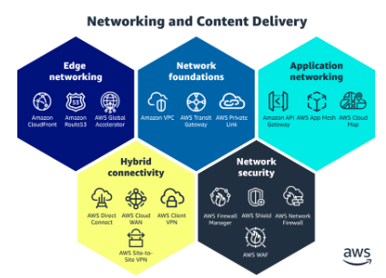
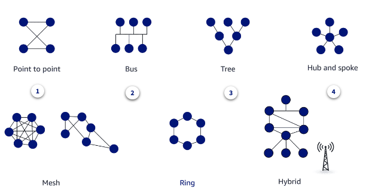

# 5. Day5-AWS-Network
## 5.1. AWS Networking Basics

### 5.1.1 AWS Networking Services

1. **AWS Network Foundations:**
     - **Amazon VPC**: Provides isolated cloud resources in a virtual network.
     - **AWS Transit Gateway**: Central hub for connecting VPCs and on-premises networks.
     - **AWS PrivateLink**: Secures private connectivity between VPCs and AWS services.

2. **Hybrid Connectivity Solutions:**
     - **AWS Direct Connect**: Dedicated network connection from on-premises to AWS.
     - **AWS Site-to-Site VPN**: Secures connections between on-premises and AWS over the internet.
     - **AWS Cloud WAN**: Simplifies global network management and operation.

3. **Edge Networking Services:**
     - **Amazon Route 53**: Scalable DNS web service.
     - **AWS Global Accelerator**: Improves global application availability and performance.

4. **Application Networking:**
     - **AWS App Mesh**: Microservices communication management.
     - **Amazon API Gateway**: Build, deploy, and manage APIs.
     - **AWS Cloud Map**: Service discovery and application resource mapping.

5. **Networking Security:**
     - **AWS Shield**: DDoS protection service.
     - **AWS WAF**: Web application firewall to protect web applications.
     - **AWS Network Firewall**: Centralized network traffic filtering.
     - **AWS Firewall Manager**: Central security management for multiple accounts and resources.

6. **AWS Networking Principles:**
   - Networking on AWS is virtualized and supports various designs, including regional, public, private, mesh, and hub-and-spoke architectures.
   - AWS networking runs on the AWS global network backbone, ensuring elasticity, scalability, and high availability.

7. **AWS Well-Architected Framework:**
   - Provides guidelines for building secure, high-performing, resilient, and efficient networks across six pillars: Operational Excellence, Security, Reliability, Performance Efficiency, Cost Optimization, and Sustainability.

8. **Shared Responsibility Model:**
   - AWS manages security of the cloud, while users are responsible for security in the cloud, including data, applications, and network traffic.

9. **Cost Optimization in Network Design:**
   - Consider data transfer costs in design decisions; use AWS tools like Cost Explorer, Billing and Management Console, AWS Budgets, and Trusted Advisor for cost management.

10. **Consistent Approach to Network Evaluation:**
    - The AWS Well-Architected Framework and Hybrid Network Lens provide a consistent approach to evaluate and implement scalable network designs over time.

11. **Balancing Agility and Security:**
    - The shared responsibility model ensures that while your network is agile, security measures are enforced to protect data as it traverses your network.


### 5.1.2 AWS Network Deep Dive



| **Category**            | **Service Name**         | **Description/Explanation**                                                                 |
|-------------------------|--------------------------|---------------------------------------------------------------------------------------------|
| **Edge Networking**      | Amazon CloudFront        | Content delivery network (CDN) that securely delivers data, videos, applications, and APIs to users globally. |
| **Edge Networking**      | Amazon Route 53          | Scalable and highly available Domain Name System (DNS) web service.                         |
| **Edge Networking**      | AWS Global Accelerator   | Improves global application availability and performance by routing traffic through AWS global network. |
| **Network Foundations**  | Amazon VPC               | Isolated network environment in the AWS Cloud, allowing you to define and control a virtual network. |
| **Network Foundations**  | AWS Transit Gateway      | Connects VPCs and on-premises networks through a central hub.                               |
| **Network Foundations**  | AWS PrivateLink          | Secures private connectivity between VPCs and AWS services without exposing data to the internet. |
| **Hybrid Connectivity**  | AWS Direct Connect       | Dedicated network connection from your on-premises environment to AWS, offering lower latency and more consistent network performance. |
| **Hybrid Connectivity**  | AWS Site-to-Site VPN     | Securely connects your on-premises network or other VPCs to your AWS VPC over the internet. |
| **Hybrid Connectivity**  | AWS Client VPN           | Managed client-based VPN service that enables secure access to AWS and on-premises resources. |
| **Hybrid Connectivity**  | AWS Cloud WAN            | Simplifies global network management and operation across your cloud and on-premises environments. |
| **Application Networking** | AWS App Mesh           | Microservices communication management by providing application-level networking for services. |
| **Application Networking** | Amazon API Gateway     | Build, deploy, and manage APIs at any scale.                                               |
| **Application Networking** | AWS Cloud Map          | Service discovery for finding and connecting microservices and cloud resources.            |
| **Network Security**     | AWS Shield               | Managed Distributed Denial of Service (DDoS) protection service.                           |
| **Network Security**     | AWS WAF                  | Web Application Firewall that helps protect web applications from common web exploits.      |
| **Network Security**     | AWS Network Firewall     | Provides network traffic filtering and monitoring, with intrusion prevention and detection capabilities. |
| **Network Security**     | AWS Firewall Manager     | Centralized management of firewall rules across multiple accounts and resources.            |

1. **Network Foundations:**
   - Amazon VPC, AWS Transit Gateway, and AWS PrivateLink are the building blocks of a scalable, isolated, and secure network infrastructure on AWS.
   - These services provide the flexibility to create and manage virtual networks in the cloud, connecting them securely to on-premises environments.

2. **Hybrid Connectivity:**
   - AWS Direct Connect, AWS Site-to-Site VPN, AWS Client VPN, and AWS Cloud WAN enable seamless integration between on-premises environments and AWS.
   - They support diverse connectivity needs, from secure VPNs to dedicated high-performance connections, ensuring consistent performance and security.

3. **Edge Networking:**
   - Amazon CloudFront, Amazon Route 53, and AWS Global Accelerator optimize global content delivery, DNS management, and application performance.
   - These services reduce latency, enhance security, and improve the user experience by leveraging AWS’s global network.

4. **Application Networking:**
   - AWS App Mesh, Amazon API Gateway, and AWS Cloud Map facilitate communication between microservices, manage APIs, and provide service discovery.
   - They enhance application performance, scalability, and manageability, making them essential for modern cloud-native architectures.

5. **Network Security:**
   - AWS Shield, AWS WAF, AWS Network Firewall, and AWS Firewall Manager offer comprehensive security to protect networks and applications from threats.
   - These services ensure that AWS environments are protected against DDoS attacks, web exploits, and unauthorized access, maintaining high availability and compliance.

6. **Optimizing Communications and Data Transfer:**
   - AWS networking and content delivery services are designed to optimize communications and data transfer, ensuring high security, reliability, and performance.
   - These services integrate seamlessly, providing a robust foundation for running network and application workloads on AWS.

7. **Elasticity and Cost Efficiency:**
   - The elasticity of AWS services allows for efficient capacity planning, reducing costs by enabling you to pay only for what you use while maintaining the flexibility to scale up or down as needed.

8. **Shared Responsibility Model:**
   - AWS provides security "of" the cloud, while customers are responsible for security "in" the cloud, necessitating a well-thought-out security strategy leveraging AWS tools.

### 5.1.3 Networking Concepts



**Network Types in the Image:**

| **Name**        | **Description**                                                                                       |
|-----------------|-------------------------------------------------------------------------------------------------------|
| **Point to Point** | A direct connection between two devices. Simple and used for dedicated connections.                 |
| **Bus**            | All devices are connected to a single communication line, known as a bus. Efficient but has a single point of failure. |
| **Tree**           | A hierarchical topology where nodes are connected like a tree structure. Used in large networks.    |
| **Hub and Spoke**  | Central hub connects to various nodes. The hub acts as a repeater, distributing signals to other nodes. |
| **Mesh**           | Devices are interconnected, providing multiple paths for data to travel. High reliability and redundancy. |
| **Ring**           | Each device is connected to two others, forming a ring. Data travels in one direction, preventing collisions. |
| **Hybrid**         | Combines two or more topology types (e.g., Mesh and Ring) to leverage the strengths of each.        |

---


1. **Network Design in AWS**: AWS provides flexibility in VPC design, mirroring traditional topologies with options for zone-based segmentation using VLANs and firewalls.

2. **Network Topologies**: Understanding network flow is essential when designing or troubleshooting AWS networks, with hub-and-spoke topologies often preferred.

3. **Design Patterns**: Planning for potential failures, future growth, and system integrations is key when setting up network topology in AWS, ensuring no single point of failure.

4. **Network Protocols**: Familiarity with network management, communication, and security protocols is crucial for optimizing AWS network performance and security.

```markdown
**Communication protocols** determine the formats and rules used to transfer data over the network. This applies to both hardware and software. Communication protocols also handle authentication and error detection as well as the syntax, synchronization, and semantics that both analog and digital communications must abide by to function.
**Network management protocols** define the policies and procedures used to monitor, manage, and maintain your network. This ensures stable communication and optimal performance for your network, and these protocols can be applied to all devices on your network (computers, switches, routers, and servers). Management protocols help to: Troubleshoot connections between host and client devices. 
Provide connection's status, availability, packet or data loss, and so on related to the health of your network connection.
Network security protocols ensure that data traffic on your network is secure. These protocols define how the network secures data from malicious attempts. This protects the data from unauthorized users, services, or devices that access your network data. Network security protocols rely on encryption and cryptography to secure data.
**Network design protocols** and network configuration protocols are a combination of network management, communication, and security protocols.
```

5. **IP Addressing**: AWS uses both IPv4 and IPv6 for communication, with CIDR providing more granular control over address allocation and subnetting enhancing network efficiency.

6. **Subnetting**: Subnetting allows the division of a network into smaller sections, improving routing, management, and security by isolating groups of hosts.

7. **Private vs. Public IPs**: AWS networks typically use a mix of private IP addresses (for internal communication) and public IP addresses (for internet-facing services).

8. **Access and Storage**: Data access in AWS is configured using network attached storage (NAS) and storage area networks (SANs), ensuring high-speed, isolated networks for data integrity and security.


### 5.1.4 AWS Implementation

1. **Logical Framework of Networking:** Understanding AWS networking begins with recognizing how data flows between devices within both local and global networks.

2. **Routing Concepts:** Routing is key in directing data from its source to its destination, both within a local network and across the global internet, where data packets traverse multiple interconnected networks.

3. **OSI Model Overview:** The OSI model, consisting of seven layers, is foundational in networking, dividing communication tasks into distinct layers, from the physical transmission of data to application-level interactions.

4. **Media and Host Layers:** The OSI model is grouped into media layers (physical to network layers) responsible for data movement and host layers (transport to application layers) that handle data processing, segmentation, and reassembly.

5. **TCP/IP Model:** The TCP/IP model simplifies the OSI model into four layers, covering essential networking functions like data transport, addressing, and application-level communication, crucial for internet communications.

6. **OSI in AWS:** AWS abstracts many OSI layers into software-defined networks, especially as virtualization blurs the lines between physical and virtual network layers.

7. **Layer Functions in AWS:** In AWS, Layer 3 (Network) adds cross-network addressing, Layer 4 (Transport) supports internet networking, and Layer 7 (Application) handles software-level protocols, all abstracted into cloud services.

8. **AWS Managed Layers:** AWS takes care of the physical layer, abstracting other layers, allowing users to focus on higher-level networking concerns within their cloud infrastructure.

9. **Virtualization and Abstraction:** AWS uses virtualization to abstract OSI layers, leading to the development of cloud-specific networking models that differ from traditional on-premises setups.

10. **Importance of Understanding Local Networking:** Before diving into global networking, it is essential to understand how data is segmented and transported within a local network, ensuring reliable communication.

11. **Application of OSI in Cloud:** Knowing the OSI model helps in managing on-premises components like servers and firewalls and understanding how AWS handles similar functionalities through abstracted cloud services.
---

| **Layer**  | **Name**            | **Description**                                                                                 |
|------------|---------------------|-------------------------------------------------------------------------------------------------|
| **7**      | Application         | Interfaces with software applications to implement communication components.                    |
| **6**      | Presentation        | Translates data between application layer and network format, handling encryption and compression.|
| **5**      | Session             | Manages sessions or connections between applications, including opening, closing, and managing them. |
| **4**      | Transport           | Ensures reliable data transfer with error checking and recovery, controls flow and segmentation.  |
| **3**      | Network             | Determines data routing, switching, and addressing between devices across different networks.    |
| **2**      | Data Link           | Provides error detection and correction from physical layer, ensuring reliable transmission across the network.|
| **1**      | Physical            | Handles the physical connection between devices, including hardware transmission of raw data bits.|

---

| **OSI Layer**      | **Service**               | **Description/Explanation**                                                                                   |
|--------------------|---------------------------|----------------------------------------------------------------------------------------------------------------|
| **Application**    | AWS WAF                   | Web Application Firewall for protecting applications from common web exploits.                                |
|                    | Amazon API Gateway        | Allows developers to create, publish, maintain, monitor, and secure APIs at any scale.                        |
|                    | Amazon CloudFront         | Content delivery network (CDN) for fast delivery of data, videos, applications, and APIs to customers globally.|
|                    | AWS Cloud Map             | A service that allows you to define custom names for your application resources and maintain the updated location of these dynamically changing resources. |
|                    | Amazon Route 53           | A scalable DNS web service for managing the global distribution of your web traffic.                           |
|                    | Elastic Load Balancer     | Automatically distributes incoming application traffic across multiple targets.                               |
|                    | AWS Global Accelerator    | Improves the availability and performance of your applications with global users.                             |
| **Presentation**   | N/A                       | Usually handled by the application layer services in AWS.                                                      |
|                    | AWS WAF                   | Web Application Firewall for protecting applications from common web exploits.                                |
|                    | Amazon API Gateway        | Allows developers to create, publish, maintain, monitor, and secure APIs at any scale.                        |
|                    | Amazon CloudFront         | Content delivery network (CDN) for fast delivery of data, videos, applications, and APIs to customers globally.|
|                    | AWS Cloud Map             | A service that allows you to define custom names for your application resources and maintain the updated location of these dynamically changing resources. |
|                    | Amazon Route 53           | A scalable DNS web service for managing the global distribution of your web traffic.                           |
| **Session**        | AWS App Mesh              | A service mesh that provides application-level networking to make it easy for services to communicate with each other across multiple types of compute infrastructure. |
|                    | AWS Direct Connect        | Establishes a dedicated network connection from your premises to AWS.                                          |
|                    | Securtiy Groups and Firewalls        | AWS Security Groups: Virtual firewalls that control traffic to AWS resources by allowing or denying specific rules. Firewalls: Security systems that monitor and control network traffic between trusted and untrusted networks.                                        |
|                    | Elastic Load Balancer     | Automatically distributes incoming application traffic across multiple targets.                               |
|                    | AWS Global Accelerator    | Improves the availability and performance of your applications with global users.                             |
| **Transport**      | AWS App Mesh              | A service mesh that provides application-level networking to make it easy for services to communicate with each other across multiple types of compute infrastructure. |
|                    | AWS Direct Connect        | Establishes a dedicated network connection from your premises to AWS.                                          |
|                    | Amazon CloudFront         | (See Application layer)                                                                                       |
|                    | NACL        | Network Access Control Lists for controlling inbound and outbound traffic at the subnet level.                                                                                      |
|                    | AWS Private Link          | Provides private connectivity between VPCs, AWS services, and on-premises networks.                            |
|                    | Elastic Load Balancer     | (See Application layer)                                                                                       |
|                    | AWS Global Accelerator    | (See Application layer)                                                                                       |
| **Network**        | AWS Cloud WAN             | Simplifies the operation of a global network through a central management console.                             |
|                    | AWS Direct Connect        | (See Transport layer)                                                                                         |
|                    | Amazon CloudFront         | (See Application layer)                                                                                       |
|                    | NACL                      | Network Access Control Lists for controlling inbound and outbound traffic at the subnet level.                |
|                    | AWS Private Link          | (See Transport layer)                                                                                         |
|                    | Route                     | Manages routing tables within a VPC.                                                                           |
|                    | AWS Transit Gateway       | Connects VPCs and on-premises networks through a central hub.                                                  |
|    **Data Linkk**                | AWS Direct Connect        | (See Transport layer)                                                                                          |
| **Physical**       | AWS Direct Connect        | (See Transport layer)                                                                                         |

---


### 5.1.5 Amazon VPC Basics

- AWS networking services connect workloads to on-premises environments, customers, and partners across a global high-speed network.
- The AWS global infrastructure is designed for high availability, consisting of multiple Regions, Availability Zones, Local Zones, and edge locations.
- Regions are geographical areas with multiple Availability Zones, ensuring fault tolerance and disaster recovery.
- Availability Zones are isolated data centers within Regions, connected by high-speed networking for redundancy.
- Local Zones bring AWS services closer to users, reducing latency for applications that require rapid response times.
- Edge locations are endpoints used for caching content through Amazon CloudFront, speeding up data delivery to users.
- AWS services are categorized into globally-resilient, regionally-resilient, and zone-resilient, each offering different levels of fault tolerance.
- Amazon VPC is a foundational service that creates secure private networks in AWS, with each VPC isolated to a specific Region.
- Default VPCs are automatically created in each AWS account and come pre-configured with subnets spread across Availability Zones.
- VPC Peering enables communication between isolated VPCs across different accounts or Regions using private IPs.
- AWS Transit Gateway simplifies global network management by allowing easier connections between VPCs and on-premises networks.
- AWS PrivateLink provides secure, private connections between VPCs, AWS services, and on-premises networks, keeping traffic off the public internet.

---

**Protocols:**
**The Internet Protocol (IP)** is how devices communicate in AWS and over the internet. There are two Internet protocols: Internet Protocol version 4 (IPv4) and Internet Protocol version 6 (IPv6). 
**The Secure Shell Protocol (SSH)** is a cryptographic network protocol for operating network services securely over an unsecured network.
**The Transmission Control Protocol (TCP)** is a standard that defines how to establish and maintain a network conversation by which applications can exchange data. TCP works with the Internet Protocol (IP), which defines how computers send packets of data to each other.
**The User Datagram Protocol (UDP)** is a communications protocol that is primarily used to establish low-latency and loss-tolerating connections between applications on the internet. UDP speeds up transmissions by enabling the transfer of data before an agreement is provided by the receiving party.

---

**Models in Networking:**
The OSI model is a logical model and it was designed to describe the functions of the communication system by dividing the communication procedure into smaller and simpler components. The TCP/IP model was designed for standard protocols and is a subsection of the OSI model. It combines the 7 layers of the OSI model into four layers.
The TCP/IP model and the OSI model are the most used communication networking protocols. The main difference between the two models is that OSI is a conceptual model. It defines how applications can communicate over a network. TCP/IP, on the other hand, is used to describe how the TCP and IP protocols establish links and interact on a network.

---

The **AWS Direct Connect** cloud service is the shortest path to your AWS resources. While in transit, your network traffic remains on the AWS global network and never touches the public internet. This reduces the chance of hitting bottlenecks or unexpected increases in latency.


**AWS Site-to-Site VPN** is a fully managed service that creates a secure connection between your data center or branch office and your AWS resources using IP Security (IPSec) tunnels. When using Site-to-Site VPN, you can connect to both your Amazon Virtual Private Cloud (Amazon VPC) and AWS Transit Gateway, and two tunnels per connection are used for increased redundancy.


A **VPC peering connection** is a networking connection between two VPCs that enables you to route traffic between them using private IPv4 addresses or IPv6 addresses. Instances in either VPC can communicate with each other as if they are within the same network. You can create a VPC peering connection between your own VPCs, or with a VPC in another AWS account. The VPCs can be in different regions (also known as an inter-Region VPC peering connection).


**AWS Transit Gateway** provides a hub-and-spoke design for connecting Amazon VPCs and on premises networks as a fully managed service without requiring you to provision virtual appliances like the Cisco cloud service routers (CSRs). No VPN overlay is required, and AWS manages high availability and scalability.

A **NAT gateway** is a Network Address Translation (NAT) service. You can use a NAT gateway so that instances in a private subnet can connect to services outside your VPC but external services cannot initiate a connection with those instances.


## 5.2. Subnets, Gateways, and Route Tables Explained

Here’s an explanation of AWS Subnets, Gateways, and Route Tables using markdown tables and conceptual illustrations:

### AWS Subnets

**Subnets** are segments of a VPC's IP address range where you can launch Amazon EC2 instances or other AWS resources. Each subnet resides within a single Availability Zone.

#### Subnets Overview

| **Term**          | **Description**                                                      |
|-------------------|----------------------------------------------------------------------|
| **VPC**           | Virtual Private Cloud, a virtual network in the AWS cloud.           |
| **Subnet**        | A segment of a VPC's IP range in which you can place resources.      |
| **Public Subnet** | A subnet associated with a route table that has a route to the internet gateway. |
| **Private Subnet**| A subnet with no route to the internet gateway, used for internal resources. |

#### Subnets Illustration

```
VPC
┌──────────────────────────────────────────┐
│                                          │
│  Availability Zone A                     │
│  ┌───────────────────────────────┐       │
│  │ Public Subnet                 │       │
│  │  (10.0.0.0/24)                │       │
│  └───────────────────────────────┘       │
│                                          │
│  Availability Zone B                     │
│  ┌───────────────────────────────┐       │
│  │ Private Subnet                │       │
│  │  (10.0.1.0/24)                │       │
│  └───────────────────────────────┘       │
│                                          │
└──────────────────────────────────────────┘
```

### AWS Gateways

**Gateways** allow traffic to enter or leave your VPC. There are several types of gateways depending on your connectivity needs.

#### Gateways Overview

| **Gateway Type**      | **Description**                                                             |
|-----------------------|-----------------------------------------------------------------------------|
| **Internet Gateway**  | Allows communication between VPC resources and the internet.                |
| **NAT Gateway**       | Enables instances in a private subnet to connect to the internet while remaining unreachable from the internet. |
| **Virtual Private Gateway** | Enables secure connections between your VPC and on-premises network via VPN. |

#### Gateways Illustration

```
VPC
┌─────────────────────────────────────────────┐
│                                             │
│  ┌─────────────────────────────┐            │
│  │ Public Subnet               │            │
│  │  (10.0.0.0/24)              │            │
│  │   ┌──────────────┐          │            │
│  │   │ EC2 Instance │          │            │
│  │   └──────────────┘          │            │
│  │       ▲                     │            │
│  │       │                     │            │
│  │       ▼                     │            │
│  │   ┌──────────┐              │            │
│  │   │Internet  │              │            │
│  │   │Gateway   │              │            │
│  │   └──────────┘              │            │
│  └─────────────────────────────┘            │
│                                             │
│  ┌─────────────────────────────┐            │
│  │ Private Subnet              │            │
│  │  (10.0.1.0/24)              │            │
│  │   ┌──────────────┐          │            │
│  │   │ EC2 Instance │          │            │
│  │   └──────────────┘          │            │
│  │       ▲                     │            │
│  │       │                     │            │
│  │       ▼                     │            │
│  │   ┌──────────┐              │            │
│  │   │ NAT      │              │            │
│  │   │ Gateway  │              │            │
│  │   └──────────┘              │            │
│  └─────────────────────────────┘            │
│                                             │
│  ┌─────────────────────────────┐            │
│  │ VPN Connection              │            │
│  │   ▲                         │            │
│  │   │                         │            │
│  │   ▼                         │            │
│  │   ┌───────────────┐         │            │
│  │   │ Virtual       │         │            │
│  │   │ Private       │         │            │
│  │   │ Gateway       │         │            │
│  │   └───────────────┘         │            │
│  └─────────────────────────────┘            │
└─────────────────────────────────────────────┘
```

### AWS Route Tables

**Route Tables** determine where network traffic is directed within your VPC. Each subnet must be associated with a route table.

#### Route Tables Overview

| **Term**            | **Description**                                                                 |
|---------------------|---------------------------------------------------------------------------------|
| **Route Table**     | A set of rules (routes) that determine where network traffic is directed.       |
| **Main Route Table**| The default route table associated with a VPC.                                  |
| **Custom Route Table**| A user-created route table that can be associated with specific subnets.       |
| **Route**           | A rule in a route table that directs traffic to a specific destination.         |

#### Route Tables Illustration

```
VPC
┌──────────────────────────────────────────┐
│ Route Table                              │
│ ┌──────────────────────────────────────┐ │
│ │  Destination    |  Target             │ │
│ │  10.0.0.0/16    |  Local              │ │
│ │  0.0.0.0/0      |  Internet Gateway   │ │
│ │  10.0.1.0/24    |  NAT Gateway        │ │
│ │  172.16.0.0/16  |  Virtual Private Gateway │
│ └──────────────────────────────────────┘ │
│                                          │
└──────────────────────────────────────────┘
```


## 5.3. Configuring and Deploying VPCs with Multiple Subnets

### 5.3.1 AWS Virtual Private Cloud (VPC)

1. **Definition**: An Amazon VPC is a virtual network in the AWS Cloud, akin to a virtual data center. It allows users to define a network boundary around AWS resources and services.

2. **Types of VPCs**:
     - **Default Amazon VPC**: Automatically created in each AWS Region when you create an AWS account. It includes:
     - A public subnet in each Availability Zone of the region.
     - Default route configurations allowing all inbound and outbound traffic to the internet.
     - A single default VPC per region with a pre-defined CIDR range (`172.31.0.0/16`).
     - Automatic subnet distribution across Availability Zones for resiliency.

     - **Custom Amazon VPC**: A user-defined virtual network that requires explicit configuration for:
     - IP address ranges (CIDR blocks) and subnets.
     - Traffic flow management, routing, and network gateways.
     - IPv4 and IPv6 support, which cannot be modified later.

3. **Default VPC Features**:
     - **Subnets**: Each subnet within a default VPC is unique and non-overlapping in its IP address range.
     - **CIDR Range**: The default IPv4 CIDR range is `172.31.0.0/16`, with a /64 IPv6 CIDR for subnets.
     - **Internet Access**: All default subnets are configured with routes to the internet, allowing both public and private IP addresses for instances.

4. **Custom VPC Features**:
     - **Isolation**: Provides a logically isolated network with complete control over IP address ranges, subnets, and traffic flow.
     - **Custom Configuration**: Requires manual setup for all aspects, including subnets, routing, and security configurations.

5. **Security and Connectivity**:
     - **Security Groups and Network ACLs**: Used to manage inbound and outbound traffic to resources within the VPC.
     - **Network Connectivity Options**: Includes AWS Direct Connect, Site-to-Site VPN, and Client VPN for extending your VPC to on-premises networks.

6. **Public vs Private Subnets**:
     - **Public Subnet**: Configured to allow internet access, typically used for web servers and applications.
     - **Private Subnet**: Does not have direct internet access, used for securing databases or backend systems.

7. **Hybrid Cloud Configurations**: AWS supports connecting an Amazon VPC with on-premises locations via hybrid cloud setups.

8. **Resiliency**: In a default VPC, if an Availability Zone fails, the subnets in other Availability Zones remain operational.

9. **Route Tables and Network Gateways**: Custom VPCs require explicit setup for routing and managing network traffic.

10. **Dynamic Host Configuration Protocol (DHCP)**: Default VPCs come with a pre-configured DHCP option set for automatic IP address assignment.

11. **VPC Modification**: Custom VPC components like subnets and routing can be modified as needed, while some configurations (like CIDR blocks) are fixed.

12. **Resource Deployment**: Both VPC types support deployment of resources within the defined network boundaries of the AWS region.


### 5.3.2 Deploying a Basic Amazon VPC

1. **Region Scope**: An Amazon VPC is confined to a single AWS Region. The choice of Region affects costs and latency. Verify that required AWS services are available in the selected Region.

2. **Subnet and Availability Zones**: A subnet is limited to one Availability Zone, even though an Amazon VPC can span multiple Availability Zones.

3. **Resource Launch**: Many AWS resources must be launched within an Amazon VPC. If the VPC becomes unavailable, these resources will also be affected.

4. **Internet Access**: Internet gateways allow resources in a VPC to reach the internet. Subnets with routes to an internet gateway are termed public subnets.

5. **Internet Gateway Characteristics**: Internet gateways are horizontally scaled, redundant, and highly available. They are not a single point of failure.

6. **Route Tables**: Route tables manage traffic routing in a VPC. Each VPC has a main route table, but custom route tables can be created and associated with subnets for more granular traffic control.

7. **Public vs. Private Subnets**: The main difference between public and private subnets is that public subnets have a route to an internet gateway.

8. **DNS Management**: By default, Amazon VPC handles DNS. Amazon Route 53 can be used to create custom DNS configurations within the VPC using private hosted zones.

9. **Traffic Forwarding**: All traffic within the same VPC is forwarded directly. Network ACLs can be used to control traffic between subnets.

10. **Subnet IP Addressing**: Subnets have reserved IPs for AWS infrastructure. For planning, remember to account for reserved IPs (5 per subnet).

11. **Creating a VPC**: Use the AWS Management Console to create a VPC. Assign a CIDR block, choose between default and dedicated tenancy, and optionally add tags for management.

12. **Attaching an Internet Gateway**: Create an internet gateway, attach it to your VPC, and update route tables to enable internet access for subnets.

13. **Route Table Management**: Custom route tables can be created and associated with specific subnets. Update the route table to direct traffic to an internet gateway for public subnets.

14. **VPC Default Resources**: Each Region has a default VPC with default subnets and route tables. Custom VPCs are recommended for production environments.

15. **Subnet Creation**: When creating a subnet, specify the CIDR block and associate it with your VPC. Ensure the subnet's IP range meets your needs, considering AWS reservations.

16. **Public Subnet Routing**: Ensure that public subnets have routes configured to the internet gateway for internet connectivity. Update the subnet's route table accordingly.

### 5.3.3 AWS Security Features

#### Network ACLs (Access Control Lists)
  - **Definition**: Network ACLs act as firewalls for controlling traffic entering or leaving a subnet in a VPC.
  - **Scope**: Operate at the subnet level, affecting all traffic crossing the subnet boundary.
  - **Default Behavior**: By default, a network ACL allows all traffic in and out. It can be customized or replaced.
  - **Stateless**: Traffic rules are applied independently for inbound and outbound traffic. Both must be explicitly allowed.
  - **Use Case**: Ideal for restricting broad IP address ranges or blocking public traffic to private resources.

#### Security Groups
  - **Definition**: Security groups act as firewalls for individual AWS resources, specifically Elastic Network Interfaces (ENIs).
  - **Scope**: Attach to specific AWS resources (e.g., EC2 instances), filtering traffic based on instance-level rules.
  - **Stateful**: If traffic is allowed in, the corresponding outbound response is automatically allowed.
  - **Behavior**: Rules specify allowed traffic; all other traffic is implicitly denied. 
  - **Resource Recognition**: Can reference other security groups or the same group, offering more granular control.

#### Comparison: Network ACLs vs. Security Groups
  - **Network ACLs**:
  - Stateless: Separate rules needed for inbound and outbound traffic.
  - Operate at the subnet boundary.
  - Explicitly block traffic based on rules.

  - **Security Groups**:
  - Stateful: Automatically allows responses to allowed inbound traffic.
  - Operate at the instance level.
  - Implicit deny for any traffic not explicitly allowed.

#### Additional Best Practices
  - **Multi-AZ Deployments**: Enhance availability and reduce attack surface by deploying across multiple Availability Zones.
  - **Amazon CloudWatch**: Monitor VPC components for unusual activity, capacity spikes, and potential security issues.
  - **VPC Flow Logs**: Capture and analyze traffic data to identify network issues or security breaches; stored in Amazon S3 for review.
  - **Chaining Security Groups**: Layer security by creating hierarchical access controls between web, application, and database tiers.


| **Feature/Action**                                        | **Description**                                                                                                                                                      |
|------------------------------------------------------------|----------------------------------------------------------------------------------------------------------------------------------------------------------------------|
| **AWS Identity and Access Management (IAM)**               | Controls who can access AWS resources and what they can do. Allows you to create users, roles, and policies to manage permissions.                                 |
| **Network Access Control List (network ACL)**              | Filters traffic entering or leaving a subnet in your VPC. Works at the subnet level and requires separate rules for inbound and outbound traffic.                   |
| **Security Group**                                        | Acts as a firewall for individual AWS instances. Works at the instance level and automatically allows responses to allowed inbound traffic (stateful).             |
| **Amazon CloudWatch**                                     | Provides real-time monitoring of AWS resources and applications, helping you track performance, capacity, and potential security issues.                          |
| **VPC Flow Logs**                                         | Records IP traffic information for network interfaces in your VPC, useful for diagnosing network problems and spotting security issues.                           |


### 5.3.4 Adding High Availability in AWS


1. **Custom Amazon VPC**: High availability can be achieved by creating a Multi-AZ design with two subnets, each in a separate Availability Zone.

2. **Elastic Load Balancing (ELB)**: Distributes incoming traffic across multiple targets (EC2 instances, containers, etc.), enhancing fault-tolerance and scalability.

3. **Types of Load Balancers**:
     - **Classic Load Balancer**: The original type with basic features; generally replaced by newer types.
     - **Application Load Balancer (ALB)**: Layer 7 (application layer) load balancer that supports HTTP and HTTPS, with capabilities for routing based on paths, headers, and hosts.
     - **Network Load Balancer (NLB)**: Layer 4 (transport layer) load balancer that handles millions of requests per second with static IP addresses and supports containerized applications.
     - **Gateway Load Balancer**: Manages and scales virtual appliances (e.g., firewalls), operates at layer 3 (network layer), and uses the GENEVE protocol.

4. **Expanding Amazon VPC**:
     - **Add a Second Subnet**: Create a second subnet in a different Availability Zone for high availability and to handle traffic if the primary subnet fails.
     - **Load Balancer for Traffic Management**: Use ALB to manage and distribute traffic between multiple subnets and endpoints, supporting features like A/B testing and blue/green deployments.
     - **Multi-AZ Approach**: Place subnets in different Availability Zones to reduce risk and enhance fault-tolerance.
     - **Route Tables**: Use the same route table for multiple subnets to streamline routing. A subnet can only be associated with one route table.
     - **Health Checks and Failover**: ELB provides health checks to automatically redirect traffic from unhealthy resources to healthy ones.

5. **Auto Scaling**: Automate launching new resources in a second subnet if the application becomes unavailable, ensuring minimal downtime.

6. **Traffic Management**: Use tools like Elastic Load Balancing and Amazon Route 53 for rerouting users to new resources during failures.

By implementing these strategies, you can enhance the high availability, fault-tolerance, and scalability of your AWS resources and applications.


## 5.4. Introduction – Multi-Tier Architecture

### 5.4.1 Production-Ready: Multi-Tier Architecture for an Amazon VPC

1. **Security as a Shared Responsibility**:
   - Security is no longer solely the security team's job; it's everyone's responsibility in the modern continuous integration and deployment environment. 

2. **Infrastructure Design Overview**:
   - Your infrastructure design encompasses the characteristics, requirements, constraints, and assumptions for the availability, manageability, performance, recoverability, and security of your systems.

3. **AWS Cloud Adoption Framework (AWS CAF)**:
     - **IAM**: Manage and audit user permissions across AWS services.
     - **Detective Controls**: Enhance security posture and visibility to spot issues early.
     - **Infrastructure Security**: Minimize the infrastructure surface area and enhance privacy and control.
     - **Data Protection**: Use encrypted services to safeguard data in transit and at rest.
     - **Incident Response**: Develop and execute responses to security incidents.

4. **Single-Tier Architecture**:
     - **Description**: All resources are in a single subnet, exposing them to potential attackers.
     - **Use Cases**: Suitable for simple applications like personal blogs or websites without private data, or where extended downtimes are acceptable.

      ```plaintext
      +--------------------------+
      | Public Subnet (Attacker) |
      |          |               |
      |          v               |
      |  +--------------------+  |
      |  |    Application     |  |
      |  |     Server         |  |
      |  +--------------------+  |
      |  |   Database Server  |  |
      |  +--------------------+  |
      |                          |
      +--------------------------+
      ```

5. **Multi-Tier Architecture**:
     - **Description**: Introduces additional layers of defense by separating resources into different subnets or tiers, reducing exposure to attacks.
     - **Design**: Place sensitive data at the end of the chain, using managed endpoints like load balancers or NAT options to avoid exposing parts of the application in the public subnet.

      ```plaintext
      +--------------------------+
      | Public Subnet (Attacker) |
      |          |               |
      |          v               |
      |  +--------------------+  |
      |  |    Load Balancer   |  |
      |  +--------------------+  |
      |          |               |
      |          v               |
      |  +--------------------+  |
      |  |  Application Tier  |  |
      |  +--------------------+  |
      |          |               |
      |          v               |
      |  +--------------------+  |
      |  |   Data Tier        |  |
      |  +--------------------+  |
      +--------------------------+
      ```

6. **N-Tier Architecture**:
     - **Description**: Flexible design with more than three tiers, based on application complexity.
     - **Best Practices**: Limit routing to necessary connections, use security groups and network ACLs for traffic control.

7. **Subnets and IP Management**:
     - **Considerations**: Subnets and Amazon VPCs don’t incur costs but use IP addresses. Reserve IP addresses carefully and plan for the future as CIDR blocks cannot be resized.

8. **Complex Design Considerations**:
     - **VPC Peering**: Connect two VPCs without traversing the public internet.
     - **VPN & Direct Connect**: Private connections between on-premises infrastructure and AWS resources.
     - **VPC Endpoints**: Private connections to AWS services without internet access.

9. **Amazon VPC Configuration**:
     - **CIDR Block Selection**: Choose a CIDR block with sufficient IP addresses and avoid conflicts with on-premises data center blocks.

10. **Environment Isolation**:
      - **Recommendation**: Use separate VPCs for development, production, and staging. If using a single VPC, ensure maximum isolation through network ACLs and subnets.
