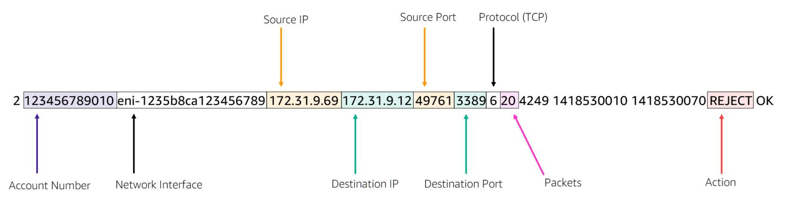
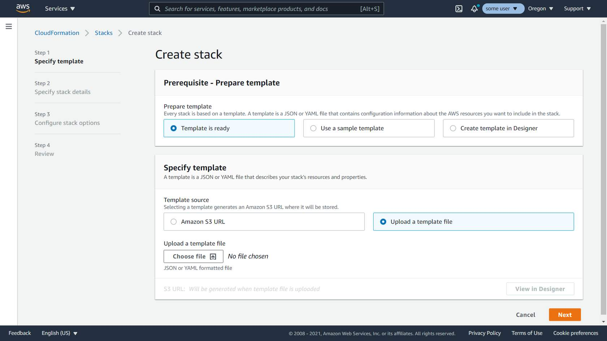
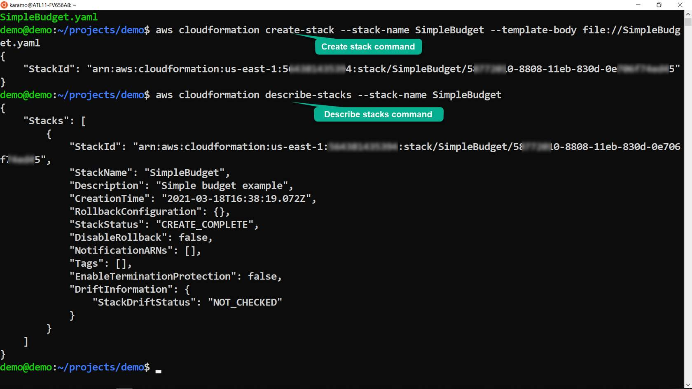

# 7. Day7-NetworkMon-Lambda
## 7.1. AWS Network – Monitoring and Troubleshooting

### 7.1.1. Introduction

  - **Account Structure and Network Strategy**: Importance of having a well-defined account structure and network strategy for proactive monitoring, troubleshooting, and forensic analysis.
  - **Network Monitoring**: Essential for ensuring the availability, uptime, operation, and performance of networks, whether on-premises, in AWS, or hybrid.
  - **Component Monitoring**: Tracking and analyzing network components like routers, switches, and firewalls in on-premises environments; within AWS, monitoring focuses on resources like Amazon EC2 instances and AWS Direct Connect.
  - **Data Layer Surveillance**: Monitoring different data layers, network endpoints, and links to diagnose, optimize, and manage network resources both onsite and remotely.
  - **Health and Performance Monitoring**: Examining the health and performance of network interfaces to detect faults and improve network management.
  - **Data Visualization**: Utilizing tables, charts, graphs, dashboards, and reports to reduce mean time to repair (MTTR) and address real-time network performance issues.
  - **Amazon CloudWatch**: A core AWS service for metrics, logs, and event management, essential for health and performance monitoring, log management, and real-time incident remediation.
  - **Automatic Troubleshooting**: Using Amazon CloudWatch to automatically troubleshoot and remediate incidents, enhancing network reliability.
  - **Network Performance Improvement**: Understanding the role of monitoring in improving network performance.
  - **Troubleshooting with Metrics**: Learning which metrics are crucial for effective troubleshooting and network optimization.
  - **Network Security Fundamentals**: Gaining insights into the basic principles of network security.
  - **Monitoring Tools and Services**: Overview of the various tools and services available within AWS for network monitoring and troubleshooting.

### 7.1.2. Develop Secure, Reliable, and High Performing Networks

  - **Network Monitoring Definition**: Involves monitoring the performance and fault tolerance of networking components like switches, routers, firewalls, servers, and VMs.
  
  - **Proactive Monitoring**: Essential for identifying performance issues and bottlenecks early to prevent downtime or failures.
  
  - **AWS Shared Responsibility Model**: AWS handles hardware and infrastructure, while customers manage their AWS services, including network traffic, security, and data integrity.
  
  - **Customer Responsibilities**: Includes data encryption, OS management, network/firewall configurations, and identity/access management.
  
  - **Complexity of Modern Networks**: Monitoring helps detect performance issues that can affect system and application performance.
  
  - **Historical Data**: Critical for establishing baselines, identifying trends, and troubleshooting past events.
  
  - **Tools for Network Troubleshooting**: Ping, traceroute, and packet analyzers help identify, diagnose, and troubleshoot network problems.
  
  - **Packet Capture**: Capturing and analyzing packets helps identify issues like missing connection release commands.
  
  - **Modern Monitoring Solutions**: Go beyond simple fault monitoring, offering metrics collection, trend analysis, and complex evaluations.
  
  - **Benefits of Monitoring**: Helps in decision-making regarding network design, equipment upgrades, and service provider performance.
  
  - **Use Cases**: Network performance monitoring, security monitoring, capacity monitoring, and application performance optimization.
  
  - **Network Security Monitoring**: Adds layers of protection against various security threats, ensuring network integrity.
  
  - **Capacity Monitoring**: Helps manage network resources by identifying bandwidth usage and applying Quality of Service (QoS) policies.
  
  - **Application Performance Optimization**: Ensures optimal application performance by monitoring API communication and network factors.

### 7.1.3. Monitoring for Troubleshooting

  - **Importance of Monitoring**: Monitoring is crucial for network troubleshooting, helping to identify, diagnose, and resolve issues within a network by tracking key metrics.
  - **Benchmark Normal Traffic**: Establish what constitutes normal traffic to differentiate between expected increases (e.g., media attention) and potential attacks.
  - **AWS Well-Architected Framework**: Staying current with new releases, services, and tools is essential. Regularly review and evolve your environment to ensure it meets business goals.
  - **Five Phases of Monitoring**: AWS monitoring includes five phases to track performance and proactively address issues before they impact users.
  - **Amazon CloudWatch**: This service collects and tracks metrics, monitors log files, sets alarms, and provides system-wide visibility into AWS resources and workloads.
  - **Active and Passive Monitoring**: A combination of active and passive monitoring gives a comprehensive view of network performance, with best practices recommending the use of both.
  - **Automated Remediation**: CloudWatch integrates with services like AWS Lambda to automate responses to performance issues, reducing human error and speeding up resolution.
  - **Proactive Monitoring**: Use KPIs and alarms to proactively address performance issues, leveraging automation for quick remediation and escalations if needed.
  - **Network Performance Metrics**: Key metrics for monitoring include bandwidth capacity, throughput, latency, packet loss, retransmission, availability, connectivity, and server response time.
  - **Custom Metrics and Alarms**: CloudWatch supports custom metrics and derived metrics, enabling tailored monitoring solutions that trigger alarms when thresholds are breached.
  - **Routine Metric Reviews**: Regularly review collected metrics to identify which were critical in resolving issues and refine monitoring strategies based on these insights.
  - **CloudWatch Dashboards**: Create reusable dashboards to monitor operational status and quickly identify issues, reducing the risk of false positives.
  - **AWS Network Manager**: Monitors global networks, devices, and connections, providing historical data to improve network management over time.
  - **CloudWatch Integration**: Integrate CloudWatch with other AWS services (e.g., Kinesis, SQS) to enhance monitoring and automate responses to network issues.
  - **Key Performance Indicators (KPIs)**: Establish KPIs to measure workload performance and use these to inform monitoring and alerting strategies.
  - **Incident Response**: Utilize monitoring dashboards during incidents to diagnose and respond to issues, updating KPIs and thresholds as necessary.

### 7.1.4. How Security Applies

1. **Importance of Network Security Monitoring**:
   - Network security monitoring focuses on securing the network by detecting suspicious behavior and unauthorized changes.
   - Most network attacks target unprotected and unmonitored networks.

2. **Security Monitoring**:
   - Involves Security Information Monitoring (SIM) and Security Event Monitoring (SEM).
   - Provides real-time analysis of security alerts and helps protect against various threats, including hackers and malware.
   - Continuous security monitoring is essential for identifying vulnerabilities and maintaining compliance.

3. **Fundamentals of Network Security**:
   - Preventive measures are crucial to protect network infrastructure from unauthorized access, misuse, and other threats.
   - AWS emphasizes security, with a shared responsibility model: AWS secures the cloud, and customers secure their data in the cloud.

4. **Security Incident Response**:
   - Understanding security incident response is vital, including preparing and training teams before incidents occur.
   - Four types of controls: directive, detective, preventive, and responsive, each playing a role in managing and mitigating security risks.

5. **Implementing Network Security**:
   - Use a combination of firewalls, packet sniffers, and penetration testing to secure your network.
   - Firewalls prevent unauthorized access, packet sniffers monitor traffic, and penetration testing identifies security weaknesses.

6. **Active vs. Passive Attacks**:
   - Active attacks involve unauthorized changes and are often aggressive and immediately noticeable.
   - Passive attacks involve monitoring traffic to gather information without altering data, making them harder to detect.

7. **Security Monitoring for Compliance and Governance**:
   - Continuous security monitoring helps ensure compliance with internal policies and regulations, such as protecting Personally Identifiable Information (PII).
   - Security and compliance are different but interconnected, with security focusing on protecting assets and compliance ensuring regulatory adherence.

8. **Anomaly Detection**:
   - Anomaly detection identifies unusual patterns that deviate from normal behavior, crucial for detecting intrusions, monitoring performance, and fault detection.
   - Understanding different types of anomalies (network, application performance, web application security) helps in interpreting data and responding effectively.

### 7.1.5. Fundamentals of Tools and Services

  - **AWS Monitoring and Logging**: Essential for maintaining reliability, availability, and performance of AWS and on-premises resources by tracking service usage and network traffic.
  - **Working Backwards**: A best practice in AWS to identify critical metrics based on customer experience, setting targets, measurement approaches, priorities, and building alarms and notifications.
  - **Amazon CloudWatch**: A core AWS service for monitoring, log management, and event management, providing visibility into the health and performance of AWS resources.
  - **VPC Flow Logs**: Captures detailed information about IP traffic to and from network interfaces in your Amazon VPC for analysis and troubleshooting.
  - **Traffic Mirroring**: Allows copying of network traffic from an EC2 instance for content inspection, threat monitoring, and troubleshooting using out-of-band security appliances.
  - **VPC Reachability Analyzer**: A diagnostic tool that helps troubleshoot connectivity issues between endpoints within or across Amazon VPCs.
  - **AWS Transit Gateway Network Manager**: Centrally manages and monitors global networks built around transit gateways, covering both AWS Regions and on-premises locations.
  - **AWS CloudTrail**: Logs all API actions in your AWS account, providing audit logs for management and data events, aiding in security and compliance.
  - **COTS vs. Open-Source Tools**: AWS Marketplace offers both commercial and open-source network monitoring tools, with open-source options being customizable and scalable but lacking extensive support.
  - **Benching Tools**: Measure throughput and bandwidth to analyze network performance, with tools like iPerf/iPerf3 and Netperf being key for active bandwidth testing.
  - **iPerf/iPerf3**: Tools for measuring maximum achievable bandwidth on IP networks, offering detailed reports on bandwidth, loss, and more.
  - **ExtraHop**: A monitoring solution providing metrics on network performance, security, and cloud operations, useful for detailed analysis.
  - **Throughput vs. Bandwidth**: Bandwidth is the maximum data capacity of a medium, while throughput is the actual data transmitted, crucial for network performance forecasting and planning.

### 7.1.6. Monitoring Your Network with Amazon CloudWatch 

  - **Monitoring Importance**: Essential for maintaining reliability, availability, and performance of AWS networks and solutions.
  - **CloudWatch Metrics**: Metrics provide snapshots of resource and application performance, enabling trend analysis and baseline establishment.
  - **System-Wide Visibility**: Custom dashboards in CloudWatch offer a comprehensive view of network performance, resource utilization, and operational health.
  - **Alarms and Notifications**: Configure alarms to monitor metrics, send notifications, or automatically adjust resources when thresholds are breached.
  - **Cost Optimization**: Use metrics to identify and stop underutilized resources, reducing costs.
  - **Monitoring Plan**: Establish goals, define metrics, set baselines, and determine who monitors and responds to alerts.
  - **Baseline Establishment**: Set network performance baselines to detect anomalies and performance drifts, allowing for proactive monitoring.
  - **CloudWatch Features**: Monitor AWS Direct Connect, Network Manager, and VPCs; collect data for historical analysis; set alarms for critical thresholds.
  - **Automation**: Use CloudWatch to automate responses to events, improving time to resolution and efficiency.
  - **CloudWatch Agent**: Necessary for collecting internal system-level metrics from EC2 instances and on-premises servers, beyond default metrics.
  - **EC2 Network Monitoring**: Monitor network bandwidth, packet-per-second (PPS) performance, connections, and link-local service access to avoid performance issues.
  - **Proactive Scaling**: Plan and monitor scaling activities using CloudWatch to maintain optimal network performance.
  - **Instance-Level Monitoring**: Monitor EC2 network performance limits (bandwidth, PPS, connections) to prevent packet loss and data drops.
  - **Unified CloudWatch Agent**: Collects detailed metrics and logs from EC2 and on-premises servers for more comprehensive monitoring.
  - **Enhanced Networking**: AWS EC2 instances with SR-IOV require enhanced monitoring for high-performance networking.
  - **Shared Responsibility Model**: Understand that additional configuration is needed to fully leverage CloudWatch metrics in alignment with AWS’s shared responsibility model.

### 7.1.7. Monitoring Your Network with Amazon CloudWatch - 2 

  - **Scenario 1: Identifying HTTP 503 Errors**:
  - The application team reported intermittent issues with a legacy application hosted on two EC2 instances behind a Classic Load Balancer (CLB).
  - CloudWatch alarms indicated HTTP 503 errors, signaling that the server was overloaded or temporarily unavailable.
  - Investigation revealed a maxed-out CPU utilization on one unhealthy EC2 instance, which was patched during the last maintenance window.
  - The issue was resolved by having the application team investigate the high CPU utilization on the unhealthy instance.

  - **Scenario 2: Direct Connect Troubleshooting**:
  - Nisha designed a Direct Connect connection with 10 Gbps port speed and 10 virtual interfaces (VIFs) for different business units.
  - The application team reported slower processing times, which coincided with abnormal traffic spikes in the Direct Connect connection.
  - Initial CloudWatch metrics didn’t provide detailed visibility into individual VIF usage.
  - Nisha implemented cross-account CloudWatch functionality to monitor metrics across all 10 AWS accounts, identifying a specific account with high traffic throughput.
  - The issue was mitigated by spreading the high-traffic job over time and provisioning a dedicated Direct Connect connection for the high-utilization account.

  - **CloudWatch Namespaces and Dimensions**:
  - CloudWatch uses namespaces (e.g., AWS/EC2, AWS/NetworkManager) to organize metrics.
  - Data points are recorded at specific times with optional units of measurement and can be categorized using dimensions (e.g., InstanceID, DeviceId).

  - **Sample CloudWatch Logs**:
  - CloudWatch logs for VPC Traffic Mirroring and Transit Gateway provide granular data, including metric streams, Account ID, Region, and dimensions.
  - Metrics like `NetworkSkipMirrorIn` and `BytesIn` help monitor specific traffic behaviors, with timestamps and optional units for precision.

  - **CloudWatch Pricing**:
  - Charges are based on metrics, dashboards, logs, custom events, and more.
  - Recommendations to optimize costs include minimizing detailed monitoring, unnecessary alarms, and custom metrics, and using the AWS Free Tier where applicable.

  - **Additional Resources**:
  - The lesson includes references to tools like the CloudWatch agent and the AWS Pricing Calculator for managing and estimating costs.
  - The next lesson introduces the AWS Systems Manager Agent (SSM Agent) tool for further network management.

### 7.1.8. AWS Systems Manager Agent (SSM Agent)

  - **AWS Systems Manager (SSM)**: An AWS service for managing and controlling infrastructure across AWS resources.
  - **SSM Agent**: Amazon software installed on Amazon EC2 instances, on-premises servers, or virtual machines (VMs) for resource management.
  - **Operational Data**: Systems Manager console allows viewing and automation of operational tasks across AWS resources.
  - **Security and Compliance**: Scans managed instances, reports, and takes corrective actions on policy violations.
  - **Managed Instances**: Machines configured for use with Systems Manager after installing SSM Agent.
  - **Logging**: SSM Agent writes execution, command, and health status logs to files, which can be sent to CloudWatch Logs.
  - **Parameter Store**: Stores agent configuration settings and is a capability of AWS Systems Manager.
  - **Request Processing**: SSM Agent processes requests from Systems Manager and configures machines accordingly.
  - **Private Connectivity**: Interface VPC endpoints (AWS PrivateLink) can be used for secure communication between managed instances and Systems Manager.
  - **Security Benefits**: AWS PrivateLink restricts network traffic to Amazon's network, reducing the need for internet access.
  - **Additional Uses**:
  - Connect to hosts without exposing port 22.
  - Log SSM API calls with CloudTrail.
  - Send instance logs to CloudWatch Logs.
  - Configure CloudWatch Logs for Run Command.
  - Monitor Run Command metrics using CloudWatch.
  - **SSM Agent vs. CloudWatch Agent**:
  - CloudWatch Agent offers more detailed metrics and logs than SSM Agent.
  - CloudWatch Logs provides centralized log storage, real-time monitoring, and indefinite log retention.
  - **Pricing**: AWS Systems Manager charges based on usage, with no minimum fees or up-front commitments.
  - **Additional Resources**:
  - Security best practices for Systems Manager.
  - Creating an IAM instance profile for Systems Manager.
  - Next lesson covers CloudWatch dashboards, logs, and queries.

### 7.1.9. CloudWatch Dashboards

  - **CloudWatch Dashboards**: Customizable home pages in CloudWatch that allow monitoring of resources across multiple Regions and accounts.
  - **Customizable Views**: Create single or multiple dashboards with various metrics and alarms, tailored for different operational needs.
  - **Operational Playbooks**: Use dashboards to guide team responses during network incidents.
  - **Network Monitoring**: Dashboards can display global or region-specific network metrics, aiding in traffic analysis and performance optimization.
  - **Sharing Dashboards**: Dashboards can be shared with teams or external stakeholders, and embedded in webpages or wikis for enhanced visibility.
  - **CloudWatch Logs**: Centralized service for monitoring, storing, and accessing log files from AWS services and applications.
  - **Log Categories**: Includes log events (activity records), log streams (sequence of events from the same source), and log groups (collections of log streams with shared settings).
  - **Metric Filters**: Transform log events into CloudWatch metrics by defining terms and patterns for monitoring.
  - **Retention Settings**: Configure how long logs are retained before automatic deletion, with options to export to Amazon S3 for further analysis.
  - **Logs Insights**: Query and analyze log data with CloudWatch Logs Insights, including visualizations and a purpose-built query language.
  - **Auto Discovery**: Automatically discovers and processes fields in logs from AWS services and JSON-based logs.
  - **Query Language**: Supports commands, regular expressions, and various functions for detailed log analysis.
  - **Saved Queries**: Save and organize queries for future use, with the ability to add them to dashboards or run them on demand.
  - **Real-Time Processing**: Use subscriptions to send log events to other services like Kinesis or Lambda for real-time processing.
  - **Example Queries**: Create queries for analyzing packet transfers, IP addresses, DNS resolvers, and more.
  - **Cost Considerations**: Queries and data processing in CloudWatch Logs Insights may incur charges based on the amount of data queried.

### 7.1. Amazon CloudWatch Alarms

### 7.1.1. Amazon CloudWatch Alarms Summary

  - **Purpose of CloudWatch Alarms**: 
  - CloudWatch alarms help monitor CloudWatch metrics by setting thresholds that trigger actions like sending notifications or auto-remediations when metrics exceed or fall below specified values.

  - **Types of Alarms**:
    - **Metric Alarms**: Monitor a single metric or a result of a math expression based on metrics, initiating actions based on the threshold value over defined periods.
    - **Composite Alarms**: Aggregate multiple alarms into a single alarm that triggers only if all included conditions are met, helping to reduce alarm noise.

  - **Alarm Actions**:
  - Actions can include sending emails, running Lambda functions, viewing metrics, remediating network ACLs or security groups, etc.
  - Alarms invoke actions only when their state changes (OK to ALARM or vice versa) except for Auto Scaling actions, which can trigger actions once per minute.

  - **Metric States**:
    - **OK**: Metric is within the defined threshold.
    - **ALARM**: Metric is outside the defined threshold.
    - **INSUFFICIENT_DATA**: Not enough data is available to determine the metric's state.

  - **Evaluation Settings**:
    - **Period**: Length of time to evaluate the metric (e.g., 1 minute).
    - **Evaluation Periods**: Number of recent periods/data points to evaluate.
    - **Datapoints to Alarm**: Number of breaching data points needed to trigger an alarm.

  - **Alarm Configuration Recommendations**:
  - Set alarms for changes in VPC internet gateways, network ACLs, security groups, CloudTrail configurations, root account usage, and VPC Flow Logs.

  - **Alarm Actions on Changes**:
  - Actions can include creating OpsItems in Systems Manager Ops Center, creating incidents in Systems Manager Incident Manager, and using Amazon SNS for notifications.

  - **Handling Missing Data**:
  - Missing data can be treated as `notBreaching`, `breaching`, `ignore`, or `missing`, depending on the metric and context to avoid false positives.

  - **EventBridge Integration**:
  - CloudWatch sends events to Amazon EventBridge on state changes, which can trigger additional actions like notifications based on rules.

  - **CloudWatch Alarm Features**:
  - Create and manage up to 5,000 alarms per region/account.
  - Use ASCII characters for alarm names.
  - Disable/enable alarms and test them using API actions or AWS CLI commands.

  - **Considerations**:
  - Metrics are not always sent for inactive resources (e.g., unmounted EBS volumes).
  - Configure alarms considering how missing data should be treated to accurately reflect system health.

  - **CloudWatch Metrics Explorer**:
  - Provides enhanced observability by filtering, aggregating, and visualizing metrics based on tags and properties.

  - **Custom Metrics**:
  - Alarms can be created for custom metrics as long as all necessary dimensions, namespaces, and metric names are included.

  - **Data Aggregation vs. Alarm Actions**:
  - Unlike simple monitoring tools that only aggregate data and send notifications, CloudWatch alarms support complex workflows and automation.

### 7.1.2. VPC Flow Logs

  - **Definition**: VPC Flow Logs capture information about IP traffic going to and from network interfaces within an Amazon VPC.
  - **Purpose**: They provide visibility for monitoring network aspects and offer a history of network traffic flows.
  - **Data Collection**: Flow logs can be published to Amazon CloudWatch Logs or Amazon S3.
  - **Log Record Fields**:
    - **Version**: The version of the VPC Flow Log.
    - **AWS Account ID**: The account ID associated with the flow log.
    - **Elastic Network Interface ID**: ID of the network interface for recorded traffic.
    - **Source & Destination IPv4/IPv6 Address**: IP addresses of the source and destination.
    - **Source & Destination Port**: Ports used in the traffic.
    - **IANA Protocol Number**: The protocol used (e.g., TCP, UDP).
    - **Packets/Bytes**: Amount of data transferred.
    - **Capture Window Time**: Start and end time of the capture window in Unix seconds.
    - **Action**: ACCEPT or REJECT based on security group or network ACLs.
    - **Log Status**: OK, NODATA, or SKIPDATA.
  - **Monitoring Levels**:
    - **VPC Level**: Monitors all activity within the VPC.
    - **Subnet Level**: Monitors activity for a specific subnet.
    - **Network Interface Level**: Monitors specific ENIs on EC2 instances.
  - **Impact on Performance**: Flow logs do not affect network throughput or latency.
  - **Configuration**:
  - Choose resources, define logging parameters, and specify the destination (CloudWatch Logs or S3).
  - Set traffic filters (all, accepted, rejected) and log names.
  - **Storage**:
    - **CloudWatch Logs**: Provides real-time analysis, alerts, and insights. Data is published to a log group with unique log streams.
    - **Amazon S3**: Offers scalability and integration with tools like Athena, S3 notifications, and Elasticsearch Service.
  - **Use Cases**:
    - **Performance**: Diagnosing connectivity issues, monitoring traffic, and improving access controls.
    - **Security**: Detecting network intrusions, monitoring anomalies, and flagging unauthorized access.
    - **Compliance**: Demonstrating adherence to regulations and maintaining audit trails.
  - **Scenario Examples**:
    - **Performance**: Troubleshooting intermittent VPN connection issues using flow logs and CloudWatch metrics.
    - **Security**: Configuring alerts for specific protocols and unauthorized IP ranges.
    - **Compliance**: Creating a network design for sensitive data access and using flow logs to meet audit requirements.

vpc flow log:

### 7.1.13. AWS VPC Traffic Mirroring Summary

1. **Purpose of Traffic Mirroring**:
   - Monitor and analyze network traffic to detect anomalies, diagnose issues, and balance traffic loads.

2. **Traditional Packet Inspection**:
   - In on-premises networks, packet inspection is done through techniques like port mirroring (SPAN) or test access points (TAP).

3. **AWS Traffic Mirroring**:
   - AWS provides Traffic Mirroring to duplicate and analyze packets similarly to traditional network mirroring but without direct access to physical components.

4. **Packet Sniffing Limitations**:
   - Traffic sniffing (packet collection) in AWS is restricted to packets addressed to the network interface, excluding protocols like ARP and broadcast traffic.

5. **Traffic Mirroring Functionality**:
   - Copies IP packets sent or received by an ENI on an EC2 instance to a traffic mirror target for inspection.

6. **Use Cases**:
   - Detect network and security anomalies.
   - Gain operational insights and enhance security decisions.
   - Meet compliance requirements and troubleshoot network issues.

7. **Configuration Components**:
     - **Traffic Mirror Source**: Network interface of an EC2 instance where traffic is copied from.
     - **Traffic Mirror Target**: Destination for mirrored traffic, such as a network interface, network load balancer, or security appliance.
     - **Traffic Mirror Filter**: Rules defining which traffic is mirrored (protocols, ports, CIDR blocks).
     - **Traffic Mirror Session**: Relationship between a source and target, with associated filters.

8. **Traffic Mirroring Workflow**:
   - Mirrored traffic can be sent to another EC2 instance or Network Load Balancer with a UDP listener.
   - Supports traffic mirroring across AWS accounts and VPCs with appropriate routing.

9. **Tools and Techniques**:
   - Use open-source tools like Suricata and Zeek for monitoring.
   - Integrate with AWS tools and third-party solutions for advanced analysis.

10. **Benefits**:
    - Simplified operations without needing packet forwarding agents.
    - Enhanced security with tamper-resistant packet capture.
    - Increased monitoring flexibility with various destination options.

11. **Limitations**:
    - Requires careful planning of network design and monitoring strategy.
    - Must consider AWS quotas and network design constraints.

12. **Troubleshooting Scenarios**:
      - **Securing Infrastructure**: Deploy virtual monitoring appliances and integrate with advanced analytical tools.
      - **On-Demand Inspection**: Set up temporary monitoring environments with CloudWatch and Lambda for real-time traffic analysis.

13. **Testing and Verification**:
    - Use Traffic Mirroring for blue/green deployments to monitor new application versions with real production traffic without impacting users.

14. **Integration with CloudWatch**:
    - Monitor metrics like NetworkMirrorIn for real-time traffic data and troubleshooting.

15. **Comparison with VPC Flow Logs**:
    - VPC Flow Logs provide summary data on traffic, while Traffic Mirroring offers detailed packet-level insights for deeper analysis.

### 7.1.4. VPC Traffic Mirroring and Open-Source Tools

1. **Network Traffic Monitoring**:
     - **Zeek**: Open-source network security monitor for intrusion detection and network traffic analysis.
     - **Suricata**: Open-source threat detection engine for real-time intrusion detection, prevention, and network security monitoring.

2. **Real-Time Traffic Analysis**:
   - Use open-source tools for troubleshooting and security to analyze network traffic in real-time.

3. **iPerf3**:
     - **Bandwidth and Jitter Testing**: Tests TCP and UDP traffic for bandwidth, latency, jitter, and datagram loss.
     - **TCP Tests**: Provides statistics on network links by checking packet correctness.
     - **UDP Tests**: Measures network performance without packet checks.

4. **Wireshark**:
     - **Traffic Capture**: Captures all types of network traffic including broadcast, multicast, and unicast messages.
     - **Analysis**: Provides detailed insights into network traffic by analyzing captured data.

5. **Traffic Mirroring Configuration**:
   - Install and configure Wireshark to capture and analyze network traffic to and from controllers.

6. **Network Performance Testing**:
   - iPerf3 is used for performance testing, providing statistics on latency, jitter, and bandwidth.

7. **Tool Integration**:
   - Both Zeek and Suricata integrate with VPC Traffic Mirroring for enhanced network monitoring and security.

### 7.1.5. VPC Reachability Analyzer Summary

1. **Purpose**: The VPC Reachability Analyzer helps troubleshoot network connectivity issues within Amazon VPCs by verifying configurations and connectivity between source and destination resources.

2. **Functionality**: 
     - **Configuration Analysis**: Checks all configurations (security groups, routes, firewalls) to ensure network flow is feasible.
     - **Network Diagnostics**: Troubleshoots reachability issues between two endpoints without sending any actual traffic.

3. **Endpoints Supported**:
   - VPN gateways
   - Network interfaces
   - Internet gateways
   - VPC endpoints
   - VPC peering connections
   - Transit gateways

4. **Requirements**:
   - Source and destination must be within the same AWS account.
   - Resources must be in the same AWS Region.
   - Resources should be in the same VPC or connected through VPC peering.

5. **Steps to Use**:
     - **Create a Path**: Define the source and destination resources for the connectivity check.
     - **Analyze the Path**: Run the analysis to check if the network configuration supports the desired connectivity.
     - **View Results**: Examine the results for details on reachability or reasons for blocking.
     - **Adjust Configuration**: Modify network settings as needed and reanalyze to confirm changes.

6. **Path Analysis Details**:
   - If reachable, displays hop-by-hop details of the virtual network path.
   - If not reachable, identifies blocking components and provides explanation codes (e.g., `ENI_SG_RULES_MISMATCH`, `TGW_ROUTE_AZ_RESTRICTION`).

7. **Use Cases**:
     - **Network Troubleshooting**: Identifies misconfigurations that block traffic.
     - **Verification**: Ensures network configurations meet connectivity requirements.
     - **Proactive Monitoring**: Validates connectivity after network changes or updates.

8. **Connectivity Testing**:
   - Supports various connection types and endpoints.
   - Analyzes paths without sending traffic, focusing on configuration and possible routes.

9. **Advanced Features**:
   - Displays graphical representations of network paths.
   - Identifies the shortest path and alternative reachable paths if multiple options exist.

10. **Integration with Other AWS Services**:
    - Can be integrated with CloudWatch for alerting and Lambda for automatic remediation.

11. **Pricing**:
    - Charged per analysis run.
    - Best to run during configuration changes or when troubleshooting issues.
    - Tagging analyses can help track costs.

12. **Common Troubleshooting Scenarios**:
      - **Blocked Paths**: Identifies reasons for blocked communication between instances in different VPCs.
      - **Traffic Through Transit Gateways**: Verifies connectivity through complex transit gateway setups.
      - **Proactive Connectivity**: Uses CloudWatch integration for early detection and mitigation of connectivity issues.

13. **Benefits**:
    - Automates network diagnostics.
    - Reduces troubleshooting time.
    - Provides detailed insights into network configurations and reachability.

14. **Limitations**:
    - Only analyzes connectivity within the same VPC or connected VPCs.
    - Does not send actual network traffic, focusing solely on configuration analysis.

15. **Security and Availability**:
    - Helps maintain security and availability of applications by resolving network misconfigurations.
    - Supports robust network design and management.

16. **Documentation**:
    - Essential to document network configurations to effectively use the Reachability Analyzer and resolve issues.

### 7.1.6. AWS Transit Gateway Network Manager Overview

1. **Centralized Network Management**: AWS Transit Gateway Network Manager allows centralized management of networks built around transit gateways, providing a global view of the network.

2. **Global Network Optimization**: Uses AWS global backbone for inter-region peering and accelerated VPN to enhance application performance, reducing the need for leased lines and optimizing costs.

3. **Reduced Operational Complexity**: Simplifies the management of global networks by creating a global view of private networks and integrating on-premises resources through a centralized dashboard.

4. **Traffic Monitoring**: Monitors traffic routed through transit gateways and across the AWS Global Network, including traffic from on-premises sites to AWS and between on-premises sites.

5. **No Direct Management of Gateways**: Does not create, modify, or delete transit gateways or their attachments. Changes to transit gateways need to be made via the Amazon VPC console or EC2 APIs.

6. **Global Network Creation**: To start, create a global network to act as a container for your network objects, including transit gateways and on-premises resources.

7. **Resource Registration**: Register transit gateways and on-premises resources. This includes VPCs, Site-to-Site VPN connections, AWS Direct Connect gateways, and transit gateway peering connections.

8. **Resource Definition**: Define and add devices (physical or virtual appliances), links (internet connections), and sites (physical locations) to your global network.

9. **Route Analysis**: Use Route Analyzer to diagnose and resolve network disruptions by validating routes within transit gateway route tables and visualizing network traffic.

10. **Network Monitoring**: Utilize CloudWatch metrics, VPC Flow Logs, and CloudTrail logs to monitor and troubleshoot network performance and activity.

11. **Network Dashboard**: Access a dashboard to visualize network activity, health, and events. Includes metrics like bytes in/out, packets dropped, and alerts for changes.

12. **Geographic and Topology Views**: Provides geographic and logical views of the global network, including resource locations, connections, and network topology.

13. **Event Monitoring**: View and track system events that describe changes in the global network, such as topology changes and connectivity issues.

14. **SD-WAN Integration**: Seamlessly integrates with SD-WAN solutions to automatically provision AWS Site-to-Site VPN connections and manage network locations.

15. **Connectivity Troubleshooting**: Helps identify and troubleshoot connectivity problems with a single interface, supporting faster issue resolution.

16. **Visibility and Reporting**: Offers a unified view of network activity, performance, and availability, facilitating better management and optimization of global networks.

## 7.2. Getting Started with AWS CloudFormation

### 7.2.1. CloudFormation Basics Summary

1. **Infrastructure as Code**: CloudFormation allows you to model AWS and third-party resources using a structured text format (YAML or JSON) called a CloudFormation template.

2. **Templates and Stacks**: You define resources in a template and create a stack in AWS. CloudFormation manages and updates these resources based on the template.

3. **Change Management**: CloudFormation tracks changes and applies them consistently. It can create Change Sets for approval before applying changes.

4. **Problem Solved**: It helps manage resources that depend on each other, allowing you to group them into stacks and handle creation, updates, and deletions efficiently.

5. **Benefits**:
     - **Automate Best Practices**: Integrates with CI/CD pipelines and tools like GitHub Actions and AWS CodePipeline.
     - **Scale Worldwide**: Share templates across accounts and regions. Use StackSets for multi-account management.
     - **AWS Integration**: Works with AWS IAM, AWS Config, AWS Service Catalog, and other AWS services for automation and governance.
     - **Manage Third-Party Resources**: Includes third-party resources in your CloudFormation management and build custom resource providers.
     - **Community Extensions**: Utilize open-source projects and the CloudFormation registry to extend functionality and enforce best practices.

6. **Architecting Cloud Solutions**: Manage all infrastructure as code, use code repositories and CI/CD pipelines for creating and updating resources.

7. **Usage Scenarios**:
     - **Single Developers**: Quickly create and destroy stacks for testing and learning, then scale as needed.
     - **Enterprises**: Use CloudFormation for managing AWS resources through CI/CD pipelines and possibly for resources outside AWS.
     - **Disaster Recovery**: Recreate infrastructure in different regions or accounts for business continuity.

8. **Best Practices**:
     - **Stack Creation**: Use integration pipelines rather than manual stack creation.
     - **Resource Lifecycle**: Be cautious of resource changes and replacements.
     - **Avoid Manual Updates**: Do not modify stack resources outside of CloudFormation.

9. **Cost**: CloudFormation itself is free. Charges apply only for the resources created and API calls made on your behalf. Third-party resources may incur additional charges.

### 7.2.2. Basic Technical Concepts of CloudFormation

1. **Resources**:
   - Entities created within AWS (e.g., Amazon S3 buckets, Amazon EC2 instances, Amazon SQS queues).

2. **Templates**:
   - Text-based descriptions (in JSON or YAML) defining CloudFormation stacks and their resources.
   - Include resource definitions, dependencies, parameters, and outputs.

3. **Stack**:
   - A collection of AWS resources managed as a single unit.

4. **StackSet**:
   - A collection of stacks using the same template, applied across different accounts and Regions.
   - Allows creation, updating, or deletion of stacks across multiple accounts/Regions with a single operation.

5. **Parameters**:
   - Values provided at stack creation time to customize the stack configuration.

6. **Outputs**:
   - Values from the stack that can be accessed via the console or programmatically after stack creation.

#### 7.2.2.1 Creating CloudFormation Stacks using the AWS Management Console

1. **Open the Console**:
   - Search for and select CloudFormation in the AWS Management Console.

2. **Choose Create Stack**:
   - Click on "Create stack" to start the stack creation process.

3. **Specify the Template**:
   - Upload your own template or use a sample/template designer.
   - Templates can be provided from Amazon S3 or uploaded from your computer.

4. **Specify Details**:
   - Provide a unique name for your stack.
   - Enter parameters if required by the template.

5. **Configure More Options**:
   - Add tags to manage stacks.
   - Specify an IAM role for CloudFormation.
   - Configure advanced options (e.g., stack policy, rollback options).

6. **Review and Confirm**:
   - Review all settings before initiating stack creation.
   - Click "Create stack" to start the process.

7. **Monitor Stack Creation**:
   - View events and stack status in the console.
   - Monitor progress until the stack reaches a CREATE_COMPLETE state.

### 7.2.3 Creating CloudFormation Stacks using the AWS CLI

1. **Use the AWS CLI**:
   - Run the `aws cloudformation create-stack` command with the stack name and template location (local file or S3).

2. **Obtain Stack Information**:
   - Use the `aws cloudformation describe-stacks` command to get details about your stack.

## 7.3. AWS Well-Architected Considerations for Financial Services

### 7.3.1. Introduction

  - **AWS Well-Architected Framework Overview**:
  - Helps understand pros and cons of decisions made on AWS.
  - Teaches architectural best practices for designing and operating reliable, secure, efficient, cost-effective, and sustainable cloud workloads.
  - Consists of six pillars: Operational Excellence, Security, Reliability, Performance Efficiency, Cost Optimization, and Sustainability.

  - **AWS Well-Architected Framework Review Process**:
    - **Purpose**: Collaborative evaluation of workload architecture against the Framework's pillars and best practices.
    - **Steps**:
    1. **Define Your Workload**: Choose and define the workload to review.
    2. **Select Evaluation Pillars**: Decide which pillars of the Framework to focus on.
    3. **Select Base Framework Questions**: Choose foundational questions for initial review.
    4. **Identify Best Practices**: Determine which best practices are followed or not.
    5. **Review Improvement Plan**: Analyze and document potential improvements.
    6. **Make Improvements and Measure Progress**: Implement changes and track their effectiveness.

  - **Review Process Phases**:
    - **Phase 1: Prepare for the Review**:
    - Align as a group to focus on improving architecture, not auditing.
    - Define a simple workload initially, moving to more complex ones over time.
    - Identify participants with expertise in each Framework pillar.
    - Create or locate workload architecture diagrams.
    - Schedule a review, anticipating 4-6 hours for the first one.

    - **Phase 2: Perform the Review**:
    - Use the AWS Well-Architected Tool (AWS WA Tool) for base review questions.
    - Evaluate the workload against Framework questions and best practices for each pillar.
    - Document findings and assess each pillar’s importance to the business context.

    - **Phase 3: After the Review**:
    - Prioritize high- and medium-risk issues and improvements.
    - Develop a project plan for implementing changes.
    - Set dates and allocate resources for improvements.
    - Obtain budget approval and track progress of implemented changes.

  - **AWS Well-Architected Tool (AWS WA Tool)**:
  - Provides a central place for performing and organizing reviews.
  - Available for free in the AWS Management Console.
  - Defines workload, applies AWS Well-Architected lenses or custom lenses, and generates an improvement plan.
  - Offers mechanisms to track and measure progress.

### 7.3.2.Financial Services Industry (FSI) Lens

1. **Purpose of AWS Well-Architected Lenses**:
   - AWS Well-Architected Lenses extend the AWS Well-Architected Framework to address specific industry and technology domains.
   - Lenses include the Serverless Applications Lens, the Financial Services Industry Lens, the Data Analytics Lens, among others.

2. **FSI Lens Overview**:
   - The FSI Lens provides additional guidance for financial services, which have unique risks and regulatory requirements.
   - It is based on best practices developed from AWS's experience with global financial institutions.

3. **Review Process**:
   - When using the FSI Lens, review both the base AWS Well-Architected Framework and the lens-specific questions and best practices.

4. **FSI Lens General Design Principles**:
   - The FSI Lens is guided by principles tailored to financial services, focusing on industry-specific requirements and risks.

5. **Scenario 1: Accessing Financial Data**:
     - **Design Requirements**:
     - Strict user entitlements and data redistribution controls.
     - Low-latency access requirements.
     - Reliable network connectivity with market data providers and exchanges.

6. **Scenario 2: Simplifying Regulatory Reporting**:
     - **Design Requirements**:
     - Ensure data quality, integrity, and lineage in ingestion and processing.
     - Data encryption at rest and in transit.
     - Masking or tokenizing personally identifiable information (PII).

7. **Scenario 3: Using AI/ML**:
     - **Design Requirements**:
     - Secure architecture for code and model artifacts.
     - CI/CD pipeline integrated with change-control systems for model deployment.
     - Automated end-to-end evidence capture of the model development lifecycle.

8. **Additional Resources**:
   - For more scenarios and detailed information, refer to the FSI Lens whitepaper.

9. **Next Steps**:
   - The next lesson will include a simulated example of an FSI Lens review process.

### 7.3.3.Example: AWS Financial Services Industry (FSI) Lens Review

1. **Review Purpose**:
   - Conducted a review using the FSI Lens for a business-critical financial data workload, following a previous base Well-Architected Framework Review.

2. **Operational Excellence**:
     - **Roles and Responsibilities**: Defined risk and compliance roles for the cloud, ensuring only necessary access to resources.
     - **Engagement with Risk Management**: Implemented a process for approving cloud risk controls and engaging with risk management and internal audit functions.

3. **Compliance and Control**:
     - **Alignment with On-Premises**: Confirmed that cloud roles align with on-premises compliance and control requirements.
     - **Reporting Issues**: Identified issues with manual collection of compliance data, which is prone to human error.

4. **Risk Appetite and Innovation**:
     - **Risk Evaluation**: Established a process with the Chief Risk Officer to evaluate the criticality of workloads and potential impacts of new innovations.
     - **Risk Thresholds**: Defined acceptable risk thresholds based on business and customer impact, with Board of Directors' approval.

5. **Review Process**:
     - **Documentation**: Planned to document findings, prioritize high- and medium-risk issues, and integrate them into a backlog for remediation.
     - **Improvement Plan**: Set up steps for improvement, tracking progress with milestones, and continuous risk discovery and resolution.

6. **Next Steps**:
     - **Follow-Up Meeting**: Scheduled a follow-up meeting to discuss the report, prioritize issues, and establish an improvement plan.

7. **Team Involvement**:
     - **Roles in the Review**: Included a workload sponsor, Well-Architected pillar sponsors, and a note taker.

8. **Final Thoughts**:
     - **Productive Start**: Acknowledged the progress made and expressed commitment to refining and optimizing the workload further.

## 7.4. AWS Lambda Foundations

### 7.4.1 Introduction

  - **Serverless Computing**: Allows developers to focus on writing code without managing underlying infrastructure, as AWS handles all operational tasks like scaling, monitoring, and maintaining servers.

  - **Traditional vs Serverless**: Traditional environments require configuration, OS updates, and application platform installation, while serverless abstracts these tasks, reducing overhead and accelerating innovation.

  - **AWS Serverless Platform**: Includes fully managed services like AWS Lambda, which are integrated with tools such as AWS Serverless Application Model (AWS SAM) for simplifying serverless application deployment.

  - **AWS Lambda**: A compute service that runs code without provisioning or managing servers. Lambda automatically scales, handles resource management, and integrates with event-driven architectures.

  - **Lambda Benefits**:
    - **No Server Management**: Run code without maintaining servers.
    - **Event-Driven Execution**: Initiates functions in response to events.
    - **Automatic Scaling**: Scales to handle incoming events.
    - **Monitoring & Logging**: Built-in monitoring via Amazon CloudWatch.

  - **Event-Driven Architecture**: Uses events to trigger actions across decoupled services, enabling asynchronous communication and processing within serverless applications.

  - **Lambda Functions**: Stateless pieces of code that execute in response to events, capable of scaling rapidly to handle varying loads, and can be integrated with services like S3, DynamoDB, Kinesis, and SNS.

### 7.4.2. How AWS Lambda Works

  - **Event-driven architecture**: AWS Lambda operates based on events that trigger functions to execute the code within.
  - **Invocation models**:
    - **Synchronous Invocation**:
    - Lambda runs the function and waits for a response.
    - No built-in retries; retry logic must be managed in the application code.
    - Used by services like Amazon API Gateway, Amazon CloudFront, and others.
    - **Asynchronous Invocation**:
    - Events are queued, and the function executes without the client waiting for a response.
    - Supports destinations to send records of invocations to other services (e.g., EventBridge, SQS).
    - Used by services like Amazon SNS, Amazon S3, and Amazon EventBridge.
    - **Polling Invocation**:
    - Lambda polls services like Amazon Kinesis, SQS, or DynamoDB Streams and invokes functions based on the events.
    - AWS manages the polling and invocation process.
  
  - **Error handling**:
    - **Synchronous**: No retries; you need to handle errors in your code.
    - **Asynchronous**: Built-in retries twice.
    - **Polling**: Retry behavior varies depending on the event source.

  - **Lambda execution environment**:
    - **Secure and isolated**: Manages resources for function execution, including lifecycle support for the runtime and extensions.
    - **Lifecycle phases**:
      - **Init phase**: Sets up the execution environment, initializes runtime, and prepares extensions.
      - **Invoke phase**: Handles the actual invocation of the function.
      - **Shutdown phase**: Shuts down the environment when not in use.
  
  - **Cold and warm starts**:
    - **Cold start**: Occurs when a new execution environment is required, leading to increased latency.
    - **Warm start**: Reuses the existing environment, reducing startup latency.
  
  - **Performance optimization**:
  - Minimize cold start times by using provisioned concurrency to prepare execution environments in advance.
  - Write functions to take advantage of warm starts by:
    - Storing dependencies locally.
    - Limiting re-initialization of variables.
    - Reusing existing connections.
    - Using `/tmp` space as a transient cache.
    - Ensuring background processes are completed.

### 7.4.3. AWS Lambda Function Permissions

  - **Lambda Function Permissions** involve two key aspects:
    - **Permission to Invoke**: Controlled via an IAM resource-based policy.
    - **Permission to Act**: Defined by the Lambda function's IAM execution role.

  - **Execution Role**:
  - Assigned to Lambda functions to grant permissions to interact with other AWS services.
  - The role's policy defines allowed actions, e.g., writing to DynamoDB.
  - Must include a trust policy that allows Lambda to "AssumeRole."
  - Can use managed roles or create custom roles with the principle of least privilege.

  - **IAM Access Analyzer**:
  - Helps identify necessary permissions by analyzing AWS CloudTrail logs.
  - Generates policy templates based on permissions used during the analysis period.

  - **Resource-based Policy**:
  - Grants permissions to invoke the Lambda function to specific AWS principals (users, roles, services, or accounts).
  - Facilitates cross-account access by allowing other accounts to invoke the function.
  - Resource policies are easier to manage but have size limits for complex cross-account scenarios.

  - **Policy Comparison**:
    - **Resource-based Policies**: Associated with push event sources like API Gateway; created when triggers are added.
    - **Execution Roles**: Selected/created during function creation, controlling actions within the resource.

  - **Ease of Policy Management**:
  - Use AWS Serverless Application Model (AWS SAM) to manage policies efficiently.
  - AWS SAM scopes Lambda permissions to resources used by the application.

  - **VPC Access**:
  - Lambda functions can access VPC resources with additional VPC-specific configurations (subnet and security group IDs).
  - Requires an execution role with permissions to manage elastic network interfaces.
  - AWSLambdaVPCAccessExecutionRole policy is provided for this purpose.

  - **AWS PrivateLink**:
  - Allows private connections between VPC and Lambda using interface VPC endpoints.
  - Enables secure, private access to Lambda APIs without needing public IPs or external connections.

### 7.4.4. Authoring AWS Lambda Functions

  - **Lambda Programming Model**: You can use your own code with AWS Lambda, adapting it to a serverless architecture without significant rewrites. Lambda supports various programming languages like Node.js, Python, Java, Go, C#, Ruby, and PowerShell.

  - **IDE Integration**: Lambda is compatible with popular IDEs such as VSCode, Eclipse, IntelliJ, and PyCharm. Custom runtimes are also supported, allowing flexibility in development environments.

  - **Handler Method**: The Lambda function handler is the method that processes events. It receives two objects: the event object (which contains data and metadata) and the context object (which provides runtime information).

  - **Event Object**: The event object structure varies depending on the event source (e.g., API Gateway, S3). It contains all the necessary data for your function's logic.

  - **Design Best Practices**: 
    - **Separation of Concerns**: Separate business logic from the handler method to enhance portability and facilitate unit testing.
    - **Modularity**: Write modular functions to reduce deployment package size and simplify maintenance.
    - **Statelessness**: Treat Lambda functions as stateless. Use external services like DynamoDB, ElastiCache, or S3 to manage state data.

  - **Minimize Dependencies**: Only include necessary dependencies in your deployment package to reduce startup time. For example, avoid including entire AWS SDKs if not required.

  - **Logging**: Implement structured logging in your Lambda functions, which is crucial for monitoring and debugging via Amazon CloudWatch.

  - **Return Coding**: Ensure your function properly returns results or uses context methods (in languages like Node.js) to terminate the function and return values to the caller.

  - **Environment Variables**: Use environment variables to manage operational parameters and sensitive data, with encryption provided by AWS Lambda’s key management service.

  - **Secrets Management**: Integrate AWS Secrets Manager and Parameter Store to securely manage and retrieve secrets and configuration data in your Lambda functions.

  - **Avoid Recursive Code**: Prevent Lambda functions from calling themselves to avoid uncontrolled scaling and potential concurrency issues.

  - **CloudWatch Metrics**: Use the CloudWatch embedded metric format (EMF) to automatically extract and visualize metrics from structured log events in CloudWatch.

  - **Reuse Execution Context**: Optimize performance by reusing execution context during warm starts, including local storage of dependencies, minimizing re-initialization, and using temporary storage.

  - **Lambda Console Editor**: For simple functions, use the Lambda console editor for easy development and deployment. It’s suitable for small, standalone applications or initial experimentation.

  - **Deployment Packages**: Advance from the console by using deployment packages (either .zip files or container images) to deploy more complex Lambda functions.

  - **Automation with AWS SAM**: Utilize AWS Serverless Application Model (AWS SAM) to automate the deployment of serverless applications. SAM CLI can assist in testing, debugging, and validating Lambda functions locally before deploying them to the cloud.

### 7.4.5. Configuring Your Lambda Functions

  - **Memory Configuration:**
  - AWS Lambda allows up to 10 GB of memory allocation per function.
  - CPU and other resources are allocated linearly in proportion to the configured memory.
  - Increasing memory can reduce execution time, potentially lowering overall costs despite higher memory usage.
  - Use AWS Lambda Power Tuning tool to optimize memory and CPU settings for cost, speed, or a balanced approach.

  - **Timeout Configuration:**
  - The maximum timeout for a Lambda function is 900 seconds (15 minutes).
  - Set the timeout value based on real-world testing to avoid unnecessary costs from lengthy executions.
  - Analyzing function duration helps in identifying issues that cause longer-than-expected execution times.
  - Lambda charges based on runtime in 1-ms increments; reducing timeout can help minimize billing.

  - **Concurrency Configuration:**
  - Concurrency determines the number of function invocations that can run simultaneously.
    - **Types of Concurrency:**
      - **Unreserved Concurrency:** Default concurrency available for functions without custom limits.
      - **Reserved Concurrency:** Guarantees a fixed number of concurrent executions for a specific function.
      - **Provisioned Concurrency:** Pre-initializes environments for functions to respond with low latency, ideal for high-performance needs.
  - Concurrency limits can help manage costs, control processing times, and align with downstream resources that scale slower than Lambda.

  - **Scaling and Bursting:**
  - Lambda can handle sudden increases in function invocations with burst concurrency.
  - Burst concurrency varies by region (e.g., 3000 in US West, 1000 in Asia Pacific).
  - Functions scale beyond burst limits by an additional 500 instances per minute until a concurrency limit is reached.

  - **Billing Considerations:**
  - Charges are based on the number of requests and function duration, measured in GB-seconds.
  - The AWS Lambda Free Tier includes 1 million free requests and 400,000 GB-seconds of compute time per month.
  - It’s crucial to optimize memory and timeout settings to balance performance and cost effectively.

  - **Testing and Monitoring:**
  - Always test Lambda functions under real-world conditions to determine optimal memory, timeout, and concurrency settings.
  - Use Amazon CloudWatch to monitor metrics like ConcurrentExecutions and UnreservedConcurrentExecutions for performance insights.
  - Conduct load testing to simulate peak usage, test backend capacity, and verify error handling under high concurrency conditions.

  - **Cost Optimization:**
  - Higher memory configurations can reduce execution time, potentially lowering overall cost.
  - AWS Lambda Power Tuning helps visualize and adjust memory and CPU configurations for cost-effectiveness.

  - **Provisioned Concurrency Costs:**
  - You pay for the amount of provisioned concurrency configured and the time it's active.
  - Scale provisioned concurrency up during traffic peaks and down afterward to avoid unnecessary costs.

### 7.4.6. Deploying and Testing Serverless Applications

  - **Server-Based vs. Serverless Deployment**: Server-based deployments are like moving into a prebuilt house, where the infrastructure is predefined, while serverless deployments are akin to designing and building a house from scratch using detailed specifications.

  - **AWS Serverless Application Model (AWS SAM)**: AWS SAM simplifies serverless development by transforming simplified instructions into detailed CloudFormation templates, which act as blueprints for deploying serverless applications.

  - **Infrastructure as Code with CloudFormation**: The entire infrastructure for a Lambda function is specified in a CloudFormation template, making it possible to deploy identical stacks across multiple AWS accounts.

  - **Server-Based Developer Workflow**: Involves coding, local testing, and passing the code to DevOps for deployment, similar to moving into a pre-existing house where environments are pre-configured.

  - **Serverless Developer Workflow**: Developers package code and dependencies with a CloudFormation template, which is then deployed and tested in the cloud. Localized testing isn't an option due to the cloud-based environment.

  - **Environmental Parity**: AWS SAM ensures that identical stacks are deployed across multiple accounts, maintaining consistency in serverless applications.

  - **Simplified Experimentation**: AWS SAM allows for quick experimentation by creating and deploying stacks without the overhead of managing physical instances.

  - **Creating and Deploying with AWS SAM and Cloud9**: The demo covers creating, editing, and deploying a Lambda function using AWS SAM and Cloud9, including triggering functions with S3 events and writing outputs to DynamoDB.

  - **CloudFormation as a Blueprint**: Just like a house blueprint, the CloudFormation template specifies every detail required to build and deploy a serverless environment.

  - **Streamlined Deployment with AWS SAM**: AWS SAM reduces the complexity of managing CloudFormation templates by offering simplified commands for common serverless resources.

  - **AWS SAM Advantages**: Provides environmental parity, simplifies testing and deployment, and allows rapid experimentation in serverless environments.

  - **Hands-On Demonstration**: The lesson includes a practical demonstration of using AWS SAM and Cloud9 to deploy a Lambda function triggered by S3 events, with outputs written to DynamoDB.

  - **Practical Challenges with Serverless**: Unlike server-based environments, serverless deployment lacks the option for localized testing, necessitating cloud-based testing and deployment.

  - **AWS SAM as a CloudFormation Simplifier**: AWS SAM converts simplified instructions into detailed CloudFormation templates, making it easier to build and deploy serverless applications.

  - **Deployment Consistency**: AWS SAM ensures that the same serverless environment is consistently deployed across multiple AWS accounts, aiding in maintaining uniformity.

  - **CloudFormation and SAM Integration**: AWS SAM integrates closely with CloudFormation, using it as a foundation while simplifying its use for developers.

### 7.4.7. Monitoring and Troubleshooting

  - **AWS Lambda Monitoring**:
    - **Amazon CloudWatch Integration**: AWS Lambda automatically monitors functions and reports metrics via CloudWatch.
    - **Key Metrics Tracked**:
      - **Invocations**: Total number of times function code runs, including successful and error-prone executions.
      - **Duration**: Time spent processing an event, billed by the nearest millisecond.
      - **Errors**: Number of invocation errors, including runtime and configuration issues.
      - **Throttles**: Failed processes due to concurrency limits.
      - **IteratorAge**: Age of the last record in event source mappings from streams.
      - **DeadLetterErrors**: Failures in sending events to a dead-letter queue during asynchronous invocation.
      - **ConcurrentExecutions**: Number of function instances actively processing events.
      - **UnreservedConcurrentExecutions**: Events processed without reserved concurrency.
      - **ProvisionedConcurrentExecutions**: Events processed with provisioned concurrency, emitting current count for each invocation.

  - **Amazon CloudWatch Lambda Insights**:
    - **Lambda Insights**: A monitoring and troubleshooting tool for serverless applications that collects and summarizes system-level metrics.
    - **Lambda Insights Dashboard**:
      - **Multi-function Overview**: Aggregates runtime metrics across all Lambda functions in the AWS account and region.
      - **Single-function View**: Displays runtime metrics for individual Lambda functions to help troubleshoot specific requests.

  - **AWS X-Ray for Lambda**:
    - **X-Ray Integration**: Visualizes application components, identifies performance bottlenecks, and troubleshoots errors.
    - **Service Map & Trace Summaries**: X-Ray generates service maps and trace summaries from Lambda function data.
    - **Use Cases**:
      - **Performance Tuning**: Helps optimize Lambda function performance.
      - **Call Flow Identification**: Traces the path and timing of invocations to locate bottlenecks and failures.
      - **Cold Start Analysis**: Assesses function performance on initial invocation.
      - **Warm Start Analysis**: Evaluates function performance on subsequent invocations.

  - **Additional Monitoring and Troubleshooting Tools**:
    - **AWS CloudTrail**:
      - **API Action Logging**: Records all API actions against the application, aiding in audits and rollback of unplanned deployments.
      - **Control Plane Logging**: Default logging for Lambda management events.
      - **Optional Data Event Logging**: Logs events for every Lambda invocation.
    - **Dead-Letter Queues**:
      - **Error Capture**: Used for capturing and manually addressing critical application errors.
      - **Configuration Options**: Can be configured for asynchronous and non-stream polling events, using Amazon SNS or SQS as the queue.
      - **Lambda Console Configuration**: Dead-letter queues can be set up directly from the Lambda console.

