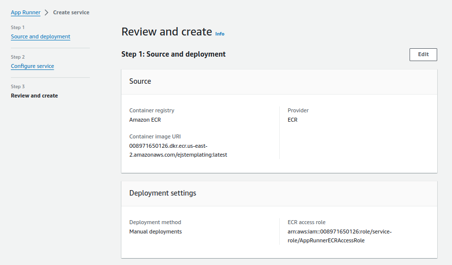
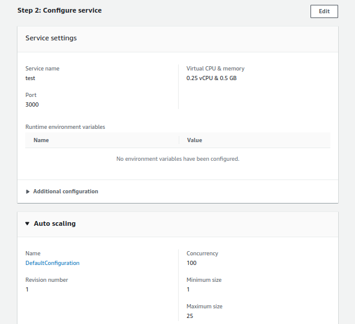
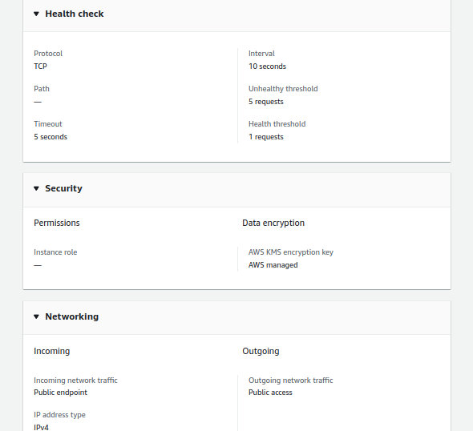
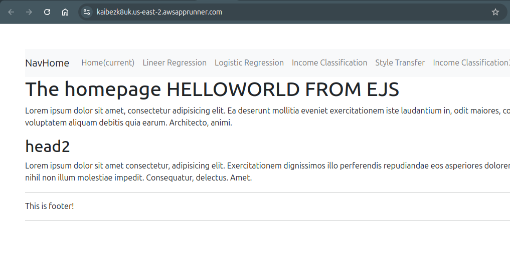
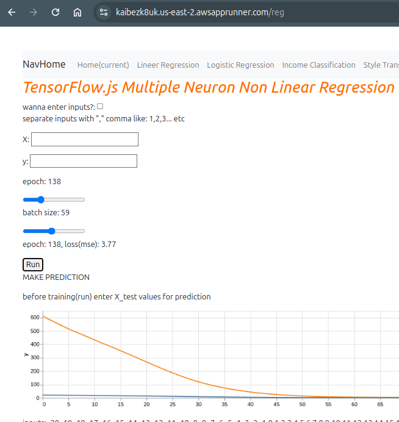

Configure AWS IAM and AWS cli:
```bash
#install aws cli 
sudo apt install python3-pip -y
pip3 install awscli --upgrade --user

#To configure first create credentials for test_user(create test_user also) from IAM.
#Then use Access key and Secret access key for configration aws cli.
#configure aws cli.
aws configure

#test configuration
aws s3 ls
```


Push Docker Image to Private ECR:
```bash
# used repo for docker image https://github.com/mustafaksr/ejs-templating.git

docker pull mustafakeser/ejstemplating:latest

aws ecr get-login-password --region us-east-2 | docker login --username AWS --password-stdin <aws-account-number>.dkr.ecr.us-east-2.amazonaws.com
aws ecr create-repository --repository-name ejstemplating --region us-east-2
docker tag mustafakeser/ejstemplating:latest <aws-account-number>.dkr.ecr.us-east-2.amazonaws.com/ejstemplating:latest
docker push <aws-account-number>.dkr.ecr.us-east-2.amazonaws.com/ejstemplating:latest

```

Access App Runner from AWS Console 













