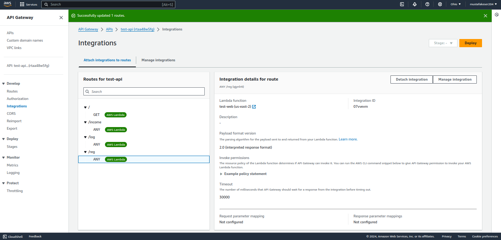
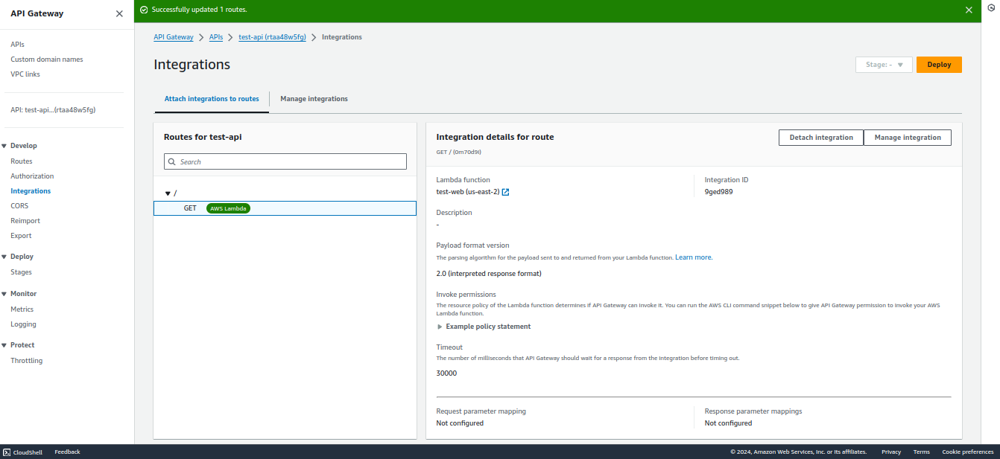
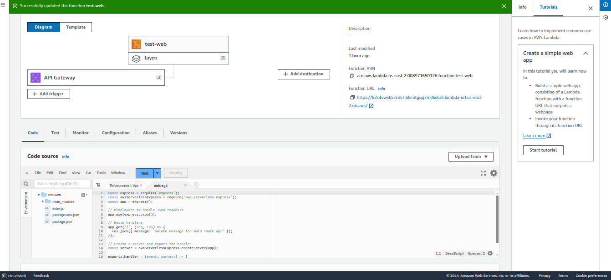
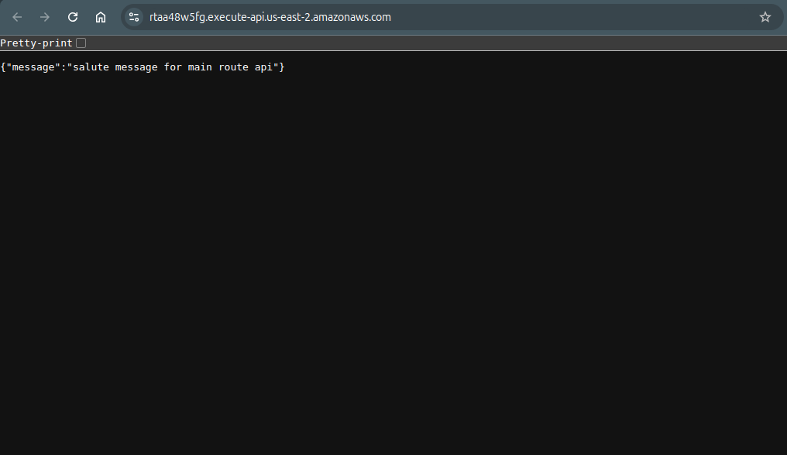

# 1.Prepare function.zip for lambda
terminal:
```bash

cd Day8-Architecting-Scaling-Serverless/implementations/lambda-apigateway/simple-api

```

index.js:
```js
const express = require('express');
const awsServerlessExpress = require('aws-serverless-express');
const app = express();

// Middleware to handle JSON requests
app.use(express.json());

// Route handlers
app.get('/', (req, res) => {
  res.json({ message: 'salute message for main route api' });
});

// Create a server and export the handler
const server = awsServerlessExpress.createServer(app);

exports.handler = (event, context) => {
    awsServerlessExpress.proxy(server, event, context);
};

```
terminal:
```bash
# Zip the Lambda package
cd Day8-Architecting-Scaling-Serverless/implementations/lambda-apigateway/simple-api

#install npm modules
npm init -y
npm install express aws-serverless-express

zip -r ../function.zip .
cd ..

# Verify zip file
ls -lh function.zip

#upload to s3
aws s3 mb s3://s3-fn-bucket-56g4dgr8
aws s3 cp function.zip  s3://s3-fn-bucket-56g4dgr8/


cd ..
```


# 2. Deploy to AWS Lambda

Deploy function from Lambda Console: 

[Create Lambda Function from Console](Create_function%20_%20Functions%20_%20Lambda.pdf)

After Function deployed 

Upload code from S3:

s3://s3-fn-bucket-56g4dgr8/function.zip


# 3. Define Route and Integrations from API Gateway

Create API Gateway and integrate with lambda for single route.


# 4. Images:









5. Delete resources

remove bucket and other resources :
```bash
#you can remove bucket with below code, remove other resources manually.
#Manually delete from Consle: Lambda function, API Gateway api
aws s3 rb s3://s3-fn-bucket-56g4dgr8 --force
```