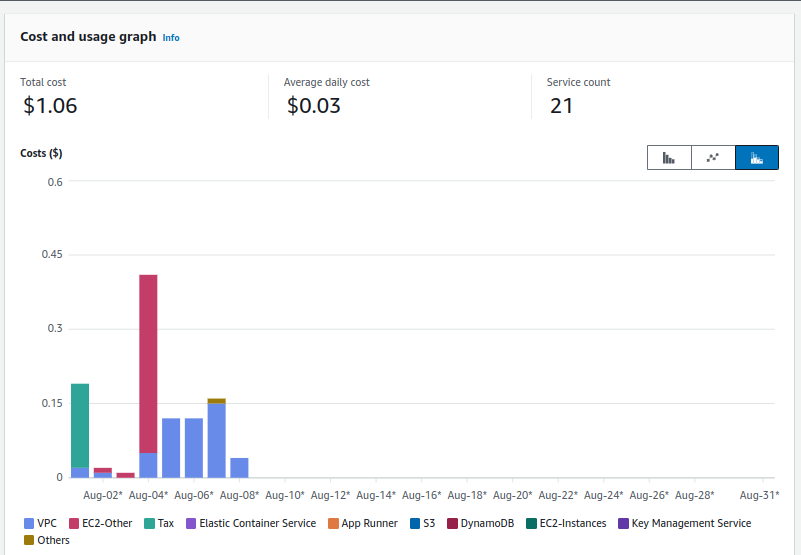

# AWS Solution Architect Knowledge Readiness Path Learning

## Overview
This repository is designed to support the AWS Solutions Architect - Knowledge Badge Readiness Path. It combines summaries and insights from a structured 15-day AWS learning journey with practical implementations. The learning plan is tailored for Solutions Architects and Solution-Design Engineers, focusing on designing and managing resilient, secure, and highly available cloud-based solutions using AWS.

The repository includes practical implementations of the learning path, focusing on Terraform-based infrastructure setups and Streamlit app deployments. These implementations illustrate the application of AWS concepts in real-world scenarios

### Learning Plan
About the Learning Path:
The AWS Knowledge Badge Readiness Path helps individuals build comprehensive knowledge in designing applications and large distributed systems on AWS. It includes domain-specific content, such as courses, knowledge checks, and a knowledge badge assessment. The path is structured to guide learners through various AWS services and best practices, but it also allows for flexibility in choosing content that best fits individual learning needs.

[View the AWS Solution Architect Knowledge Badge Readiness Path on Notion](https://helix-minnow-e03.notion.site/9e06c208efcc4f59aaf5549210ae52c7?v=0633597eaccf46fea83dbdc762aa9b9d)

## Day 1 - AWS Technical Essentials

### Notes
- [AWS Technical Essentials](Day1-aws-technical-essentials/README.md)

### Implementation
- [Terraform Streamlit App Deployment](Day1-aws-technical-essentials/implementation/)
  - Deployed a Streamlit application on an EC2 instance with an RDS database connection.
---

## Day 2 - AWS Compute Services Overview

### Notes
- [AWS Compute Services Overview](Day2-aws-iam-compute-storage/README.md)

### Implementation
- [Terraform Streamlit App Deployment](Day2-aws-iam-compute-storage/implementation/)
  - Configured an S3 bucket to store Terraform remote state for the previously deployed app.
  - Added Elastic Block Store (EBS) for persistent storage to the EC2 instance.
---

## Day 3 - AWS S3, EBS, and Databases

### Notes
- [AWS S3, EBS, and Databases](Day3-EBS-Databases/README.md)

### Implementation
- [RDS Deployment](Day3-EBS-Databases/implementation-RDS/)
  - Integrated an RDS instance with the existing EC2 Streamlit app.

- [DynamoDB Deployment](Day3-EBS-Databases/implementation-DynamoDB/)
  - Deployed a simple inventory Streamlit app on EC2 using DynamoDB for storage, featuring three text fields.

- [DocumentDB Deployment](Day3-EBS-Databases/implementation-DynamoDB/)
  - Developed a Streamlit app hosted on EC2, connected to DocumentDB and S3. The app supports two text fields and one image field.
---

## Day 4 - Dynamodb-ElastiCache

### Notes
- [Dynamodb-ElastiCache](Day4-Dynamodb-ElastiCache/README.md)

### Implementation
- [MongoDB Deployment with EC2](Day4-Dynamodb-ElastiCache/implementation-2xEC2-MongoDB-Streamlit/)
  - Set up two EC2 instances: one for MongoDB server and another for the Streamlit application.

- [ElastiCache Deployment](Day4-Dynamodb-ElastiCache/implementation-Elasticache/)
  - Implemented an application using ElastiCache to enhance performance and scalability.

---

## Day 5 - AWS Networking Basics

### Notes
- [AWS Networking Basics](Day5-AWS-Network/README.md)

### Implementation
- [Network Connectivity Deployment](Day5-AWS-Network/implementation-network/)
  - Deployed a Virtual Private Cloud (VPC) with multiple subnets using Terraform.
  - Configured public and private subnets, route tables, and NAT Gateway.
  - Validated network connectivity between instances and tested internet access via NAT Gateway.

---

## Day 6 - AWS API & Network Connectivity

### Notes
- [AWS API Gateway and Network Connectivity](Day6-API-NetworkConnectivity-SecurityGroups/README.md)

### Implementations
- [EC2 API Deployment](Day6-API-NetworkConnectivity-SecurityGroups/implementations/implementation-api/)
  - Deployed an external API on EC2, integrating routes for predictions and documentation.
  - Utilized Docker for containerization and Nginx to expose the API externally.
  - Tested API functionality with /, /docs, and /predict routes.

- [AWS Network Integration](Day6-API-NetworkConnectivity-SecurityGroups/implementations/implementation-difference-nacl-securitygroups/)
  - Enhanced network setup with public-private connectivity using Terraform.
  - Implemented AWS Security Groups and Network ACLs, tested HTTP accessibility for EC2 instances.

- [Previous AWS Network Integration](Day6-API-NetworkConnectivity-SecurityGroups/implementations/implementation-network-gateways/)
  - Deployed a Virtual Private Cloud (VPC) with multiple subnets using Terraform.
  - Configured public and private subnets, route tables, and NAT Gateway.
  - Validated network connectivity between instances and tested internet access via NAT Gateway.

---

## Day 7 - AWS Networking & Lambda Implementations

### Notes
- [AWS Network Monitoring & Troubleshooting and Lambda Foundations](Day7-NetworkMon-Lambda/README.md)

### Implementations
- [Image Resizer with AWS Lambda](Day7-NetworkMon-Lambda/implementations/lambda-s3-image-resizer/)
  - Developed a serverless image resizer using AWS Lambda and S3.
  - Images are uploaded to an S3 bucket, processed with a Python-based Lambda function using Pillow, and saved to another S3 bucket.
  - Deployed the infrastructure using Terraform.

- [EC2 Abuse Monitoring](Day7-NetworkMon-Lambda/implementations/monitoring-lambda-sns-not-tested/)
  - Implemented a monitoring solution to detect and respond to abusive EC2 usage.
  - A Lambda function, triggered by CloudWatch, stops EC2 instances showing suspicious behavior.
  - Deployed the necessary resources using Terraform.

---

## Day 8 - Scaling and Architecting Serverless Applications on AWS

### Notes
- [Architecting Serverless Applications & Scaling Considerations](Day8-Architecting-Scaling-Serverless/README.md)

### Implementations
- [Lambda Image Resizer with Auto-Scaling](Day8-Architecting-Scaling-Serverless/implementations/lambda-s3-image-resizer-autoscale/)
  - Enhanced the image resizer Lambda function from Day 7 by implementing auto-scaling.
  - Input images (.jpg) are uploaded to an S3 bucket, resized using a Python-based Lambda function with Pillow, and saved to another S3 bucket.
  - Deployed the infrastructure using Terraform.

- [Serverless Deployment with AWS App Runner](Day8-Architecting-Scaling-Serverless/implementations/app-runner-ecr/)
  - Built and deployed a Docker image for an EJS-templating web app to AWS App Runner.
  - Tagged the image, pushed it to an ECR repository, and deployed it to App Runner for a serverless deployment.

- [API Gateway Integration](Day8-Architecting-Scaling-Serverless/implementations/lambda-apigateway/)
  - Developed a Node.js Express API, deployed it using AWS Lambda, and integrated it with AWS API Gateway.
  - Created a simple, scalable serverless API solution.

---

## Day 9 - Database Migration, S3 Cost Optimization, and EBS Management

### Notes
- [Database Migration with AWS SCT and DMS](Day9-DBMigration-S3-EBS/README.md#1-introduction-to-database-migration)
- [Amazon S3 Cost Optimization](Day9-DBMigration-S3-EBS/README.md#2-amazon-simple-storage-service-amazon-s3-cost-optimization)
- [Amazon EBS Cost Optimization](Day9-DBMigration-S3-EBS/README.md#3-deep-dive-amazon-elastic-block-store-amazon-ebs-cost-optimization)

### Implementations
- [EBS Cost Optimization](Day9-DBMigration-S3-EBS/implementations/ebs-cost-optimization/)
  - Configured Terraform to manage EBS volumes with daily snapshot policies and cost monitoring.
  - Analyzed and optimized EBS volume types and snapshot costs using AWS Compute Optimizer.

- [MongoDB Database Migration](Day9-DBMigration-S3-EBS/implementations/ec2-mongodb-database-migration/)
  - Deployed an EC2 instance for MongoDB, migrated on-premises databases, and validated the setup with test queries.

- [RDS Database Migration](Day9-DBMigration-S3-EBS/implementations/rds-database-migration/)
  - Utilized Terraform to deploy RDS instances and migrated databases from on-premises to RDS, ensuring a smooth transition.

- [S3 Lifecycle Management](Day9-DBMigration-S3-EBS/implementations/s3-lifecycle-retention/)
  - Implemented S3 lifecycle policies to manage storage costs effectively, transitioning objects to different storage classes based on age and access patterns.

---

## Day 10 - Deep into AWS Storage Gateway, Step Functions, and AWS Backup

### Notes
- [AWS Storage Gateway Deep Dive: Volume Gateway](Day10-StorageGateway-StepFn-AWS-Backup/README.md)
- [AWS Storage Gateway Deep Dive: Amazon S3 File Gateway](Day10-StorageGateway-StepFn-AWS-Backup/README.md)
- [Introduction to AWS Step Functions](Day10-StorageGateway-StepFn-AWS-Backup/README.md)
- [AWS Backup Primer](Day10-StorageGateway-StepFn-AWS-Backup/README.md)

### Implementations
- [Step Functions ETL Process](Day10-StorageGateway-StepFn-AWS-Backup/implementations/step-function/)
  - Designed and deployed an AWS Step Function to manage an ETL (Extract, Transform, Load) process.
  - Implemented a step function to extract data from a JSON file, transform it (e.g., convert to uppercase), and load the transformed data into an S3 bucket.
  - Streamlined data processing tasks by automating the workflow.

---

## Day 11 - Deep Dive with Security: AWS Identity and Access Management (IAM)

### Notes
- [Deep Dive into AWS Identity and Access Management (IAM)](Day11-IAM-Deep-Dive/README.md)

---

## Day 12 - Securing Data in Amazon S3 & Protecting Instances with Security Groups

### Notes
- [Securing and Protecting Your Data in Amazon S3](Day12-SecuringS3-ProtectingSG/README.md)

---

## AWS BADGE
- [AWS Knowledge: Architecting Badge Link](https://www.credly.com/badges/e38c0c38-73fb-4fe6-98c1-11defacbd56a/public_url)
-  

---

## AWS COST

### Daily Costs of Learning Journey with Implementations

API Operations:

Services:

Usage Type:

Free Tiers Usage:

### Capstone Project Cost

continues...